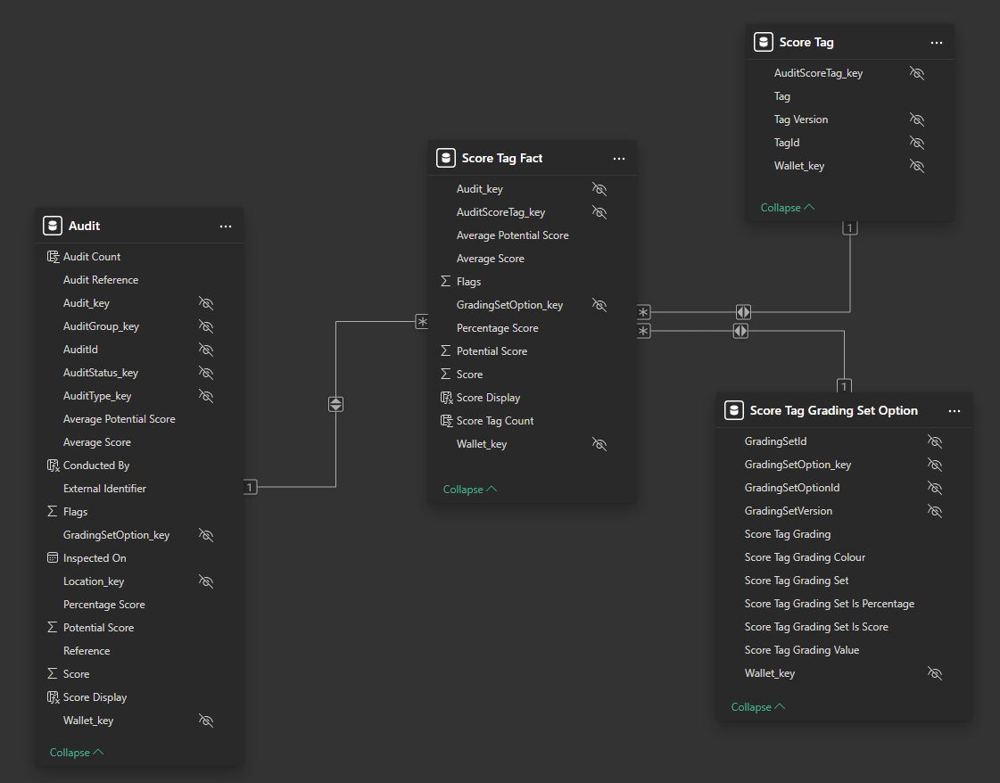
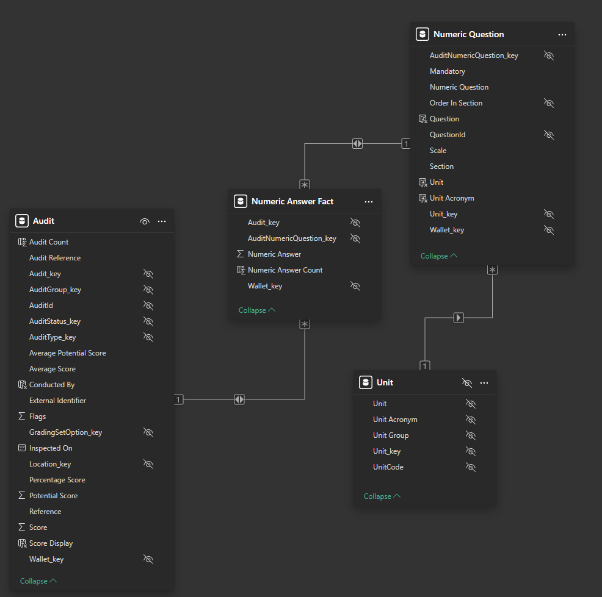

# Power BI Samples - Semantic Models

For convenience the Power BI semantic models used in the sample reports are presented here.
This information is also available within the Power BI projects in the `Model View`.

The diagrams for each area are broken down into multiple layouts for readability.
The Wallet dimension table is not shown for clarity.

To fully explore the models it is recommended that you open the relevant sample Power BI project file.

Jump to the relevant section:

* [Reported Issues](#reported-issues)
* [Audits](#audits)

## Reported Issues

### Reported Issues - Main

### Reported Issues - Body Part

### Reported Issues - Branch Option

### Reported Issues - Option Select

### Reported Issues - Person

### Reported Issues - Root Cause Analysis

## Audits

### Audits - Main

### Audits - Inspected By

### Audits - Scored Response

### Audits - Score Section

### Audits - Score Tag

### Audits - Numeric Answer

### Audits - Date Time Answer

### Audits - Checklist Answer

### Audits - Branch Option

