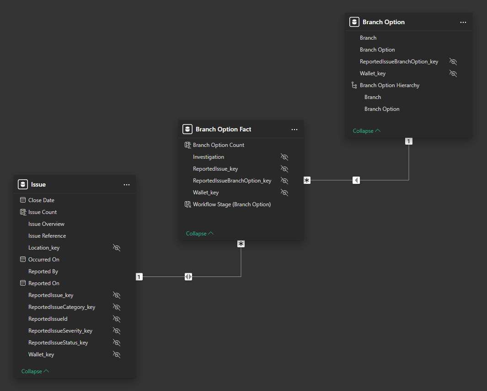
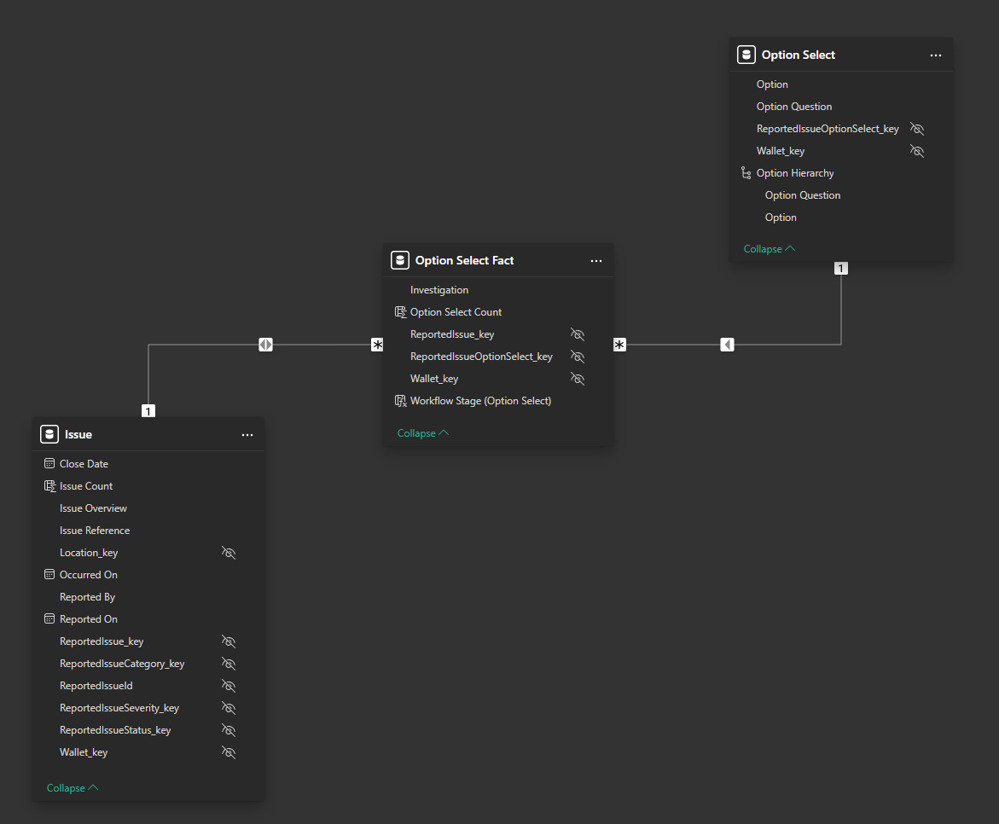

# Power BI Samples - Semantic Models

For convenience the Power BI semantic models used in the sample reports are presented here.
This information is also available within the Power BI projects in the `Model View`.

Jump to the relevant section:

* [Reported Issues](#reported-issues)

## Reported Issues

### Main

### Body Part

### Branch Option

### Option Select

### Person

### Root Cause Analysis

