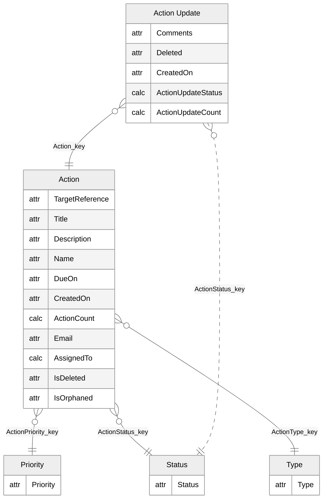

# Actions

[<- Back to index](../PowerBISamplesModels.md)

## Actions - Main

```mermaid
---
config:
  theme: neutral
---
erDiagram
    "Action" {
        attr TargetReference
        attr Title
        attr Description
        attr Name
        attr DueOn
        attr CreatedOn
        calc ActionCount
        attr Email
        calc AssignedTo
        attr IsDeleted
        attr IsOrphaned
    }
    "Priority" {
        attr Priority
    }
    "Status" {
        attr Status
    }
    "Type" {
        attr Type
    }
    "Action Update" {
        attr Comments
        attr Deleted
        attr CreatedOn
        calc ActionUpdateStatus
        calc ActionUpdateCount
    }
    "Action" }o--|| "Priority" : "ActionPriority_key"
    "Action" }o--|| "Status" : "ActionStatus_key"
    "Action" }o--|| "Type" : "ActionType_key"
    "Action Update" }o--|| "Action" : "Action_key"
    "Action Update" }o..|| "Status" : "ActionStatus_key"
```
