# Assets

[<- Back to index](../PowerBISamplesModels.md)

## Assets - Main

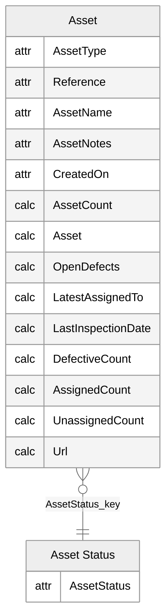

## Assets - Assignment

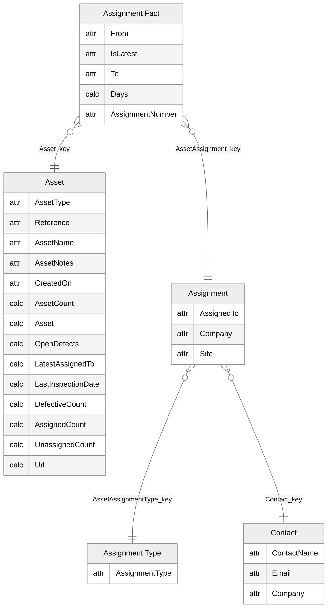

## Assets - Property

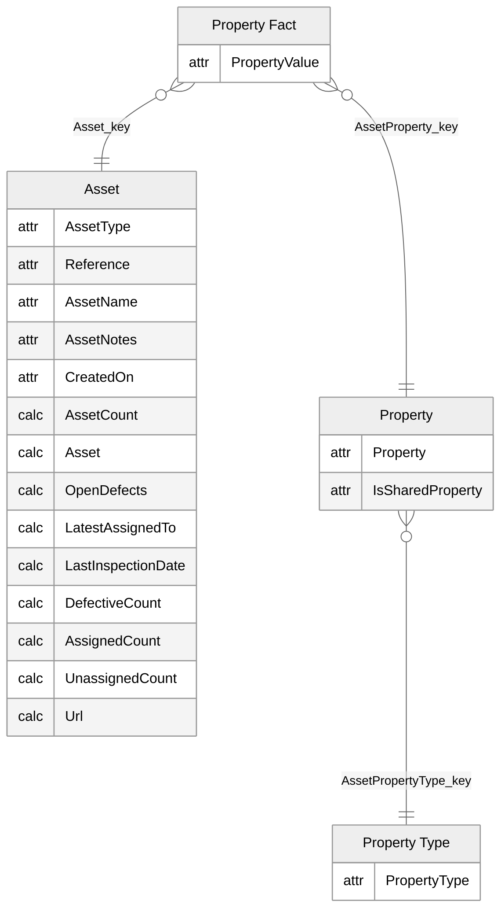

## Assets - Inspection

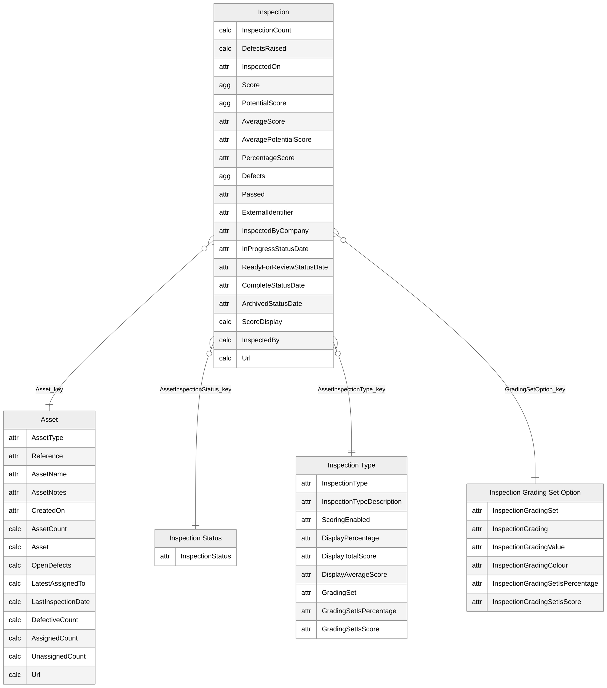

## Assets - Observation

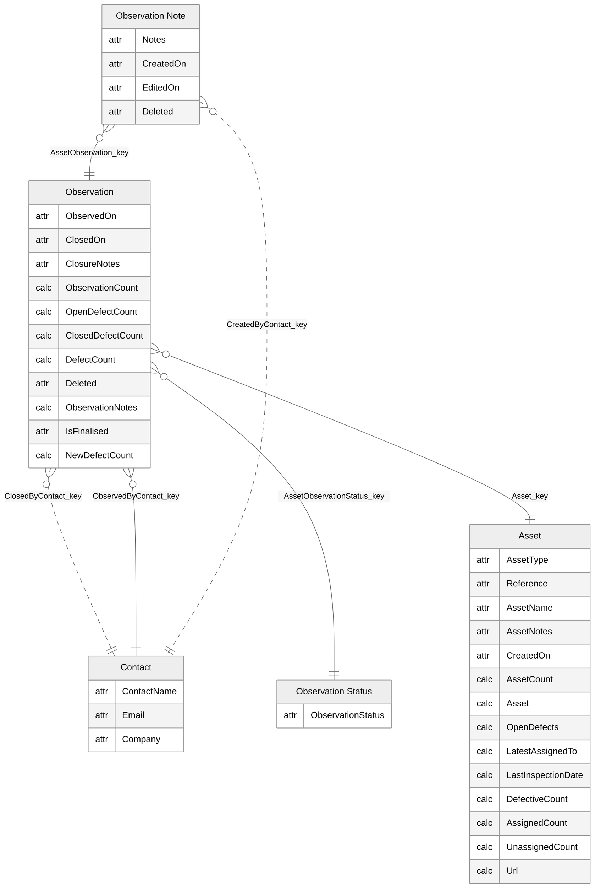

## Assets - Inspection Observation

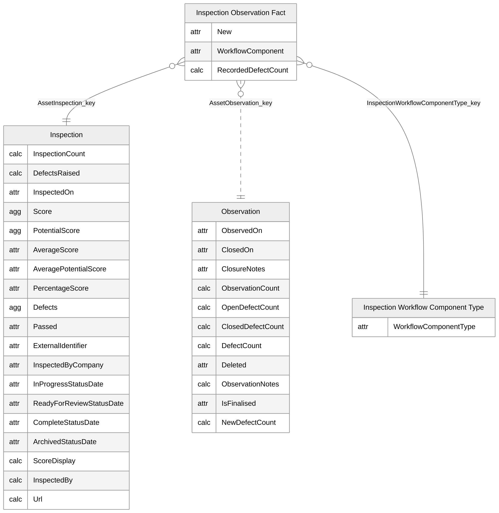

## Assets - Inspected By

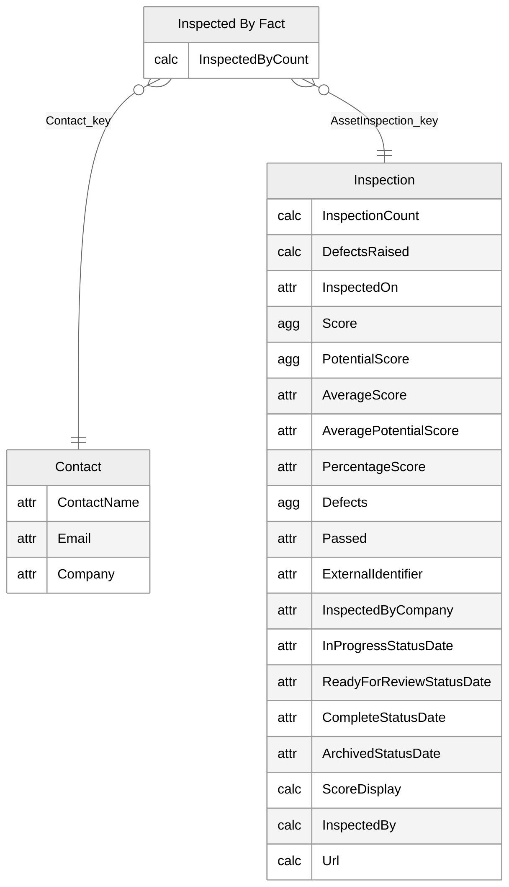

## Assets - Scored Response

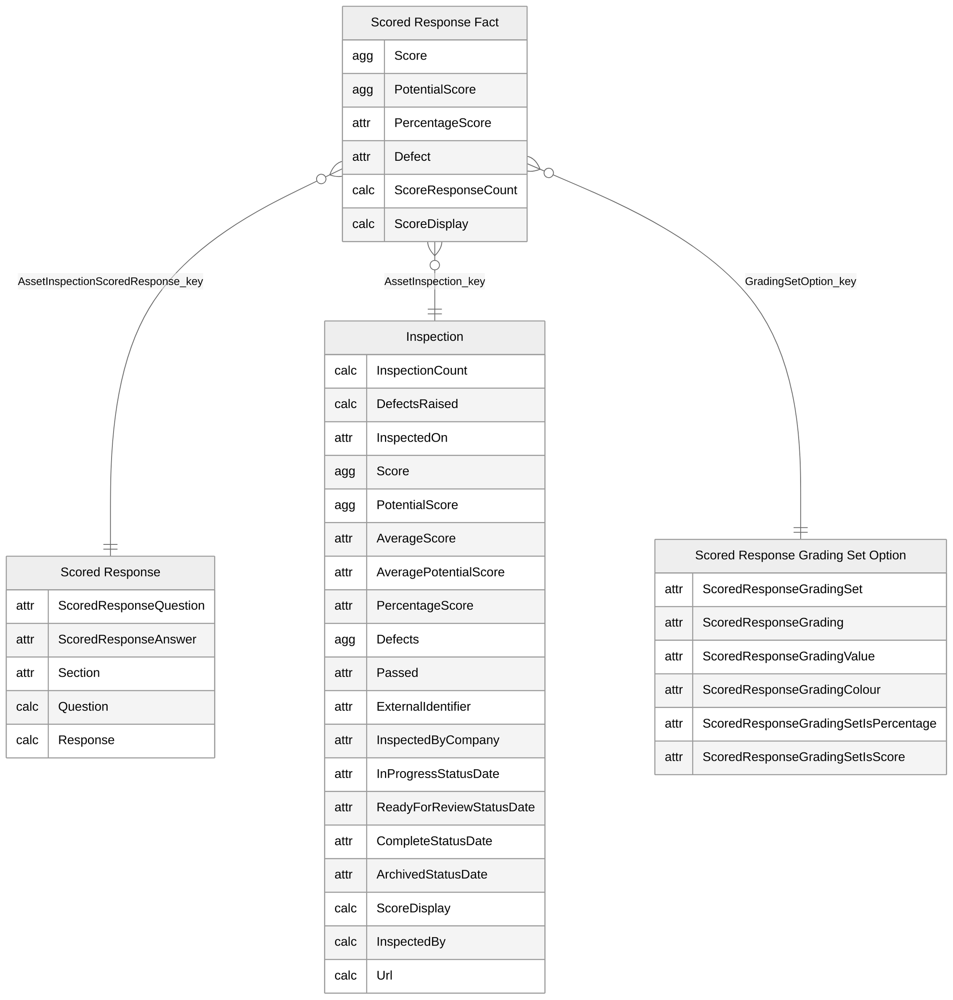

## Assets - Score Section

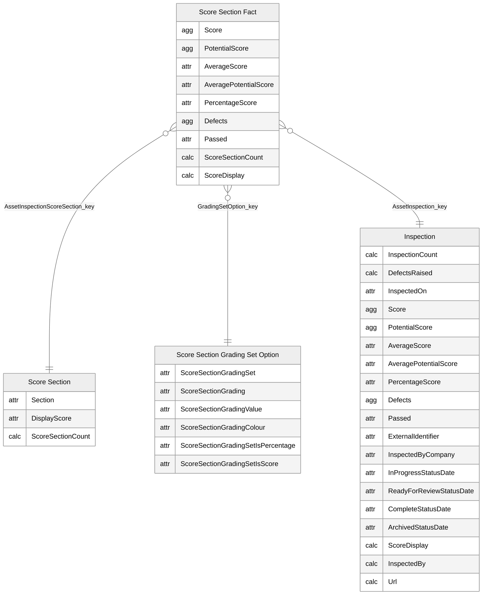

## Assets - Score Tag

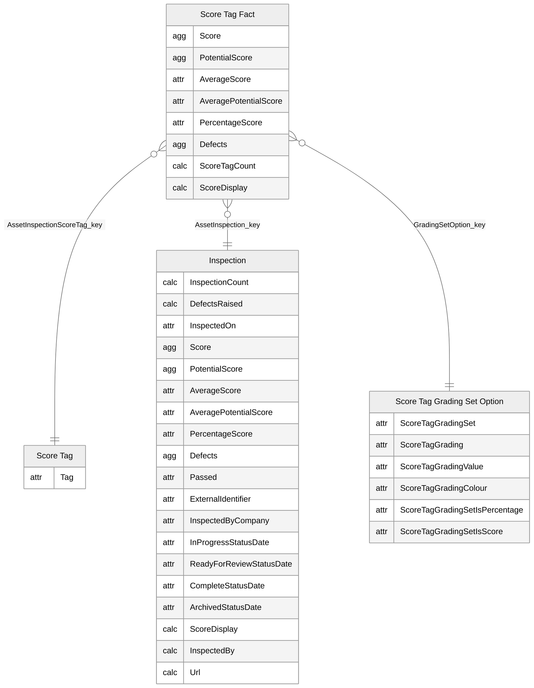

## Assets - Numeric Answer

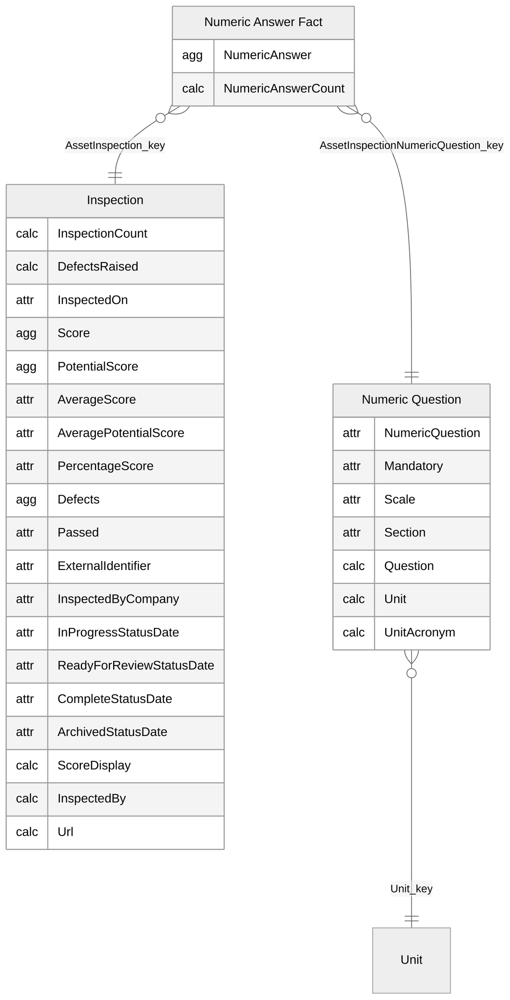

## Assets - Date Time Answer

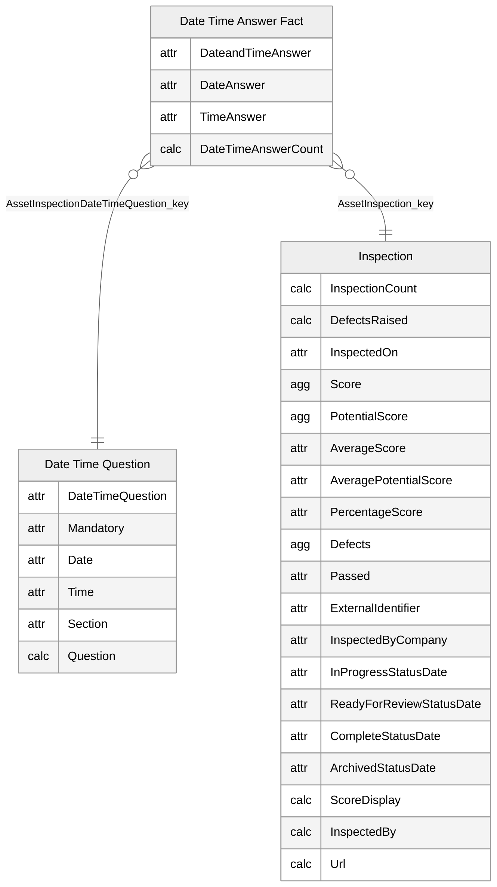

## Assets - Checklist Answer

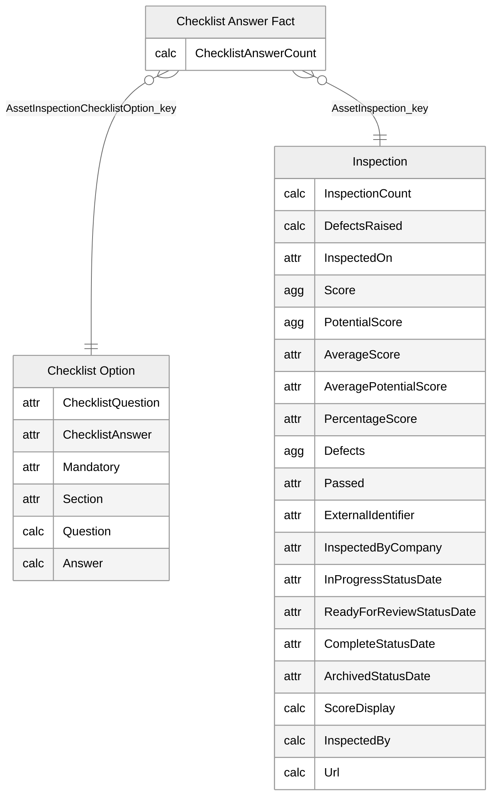

## Assets - Branch Option

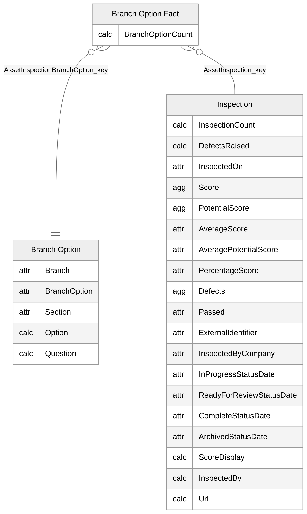
