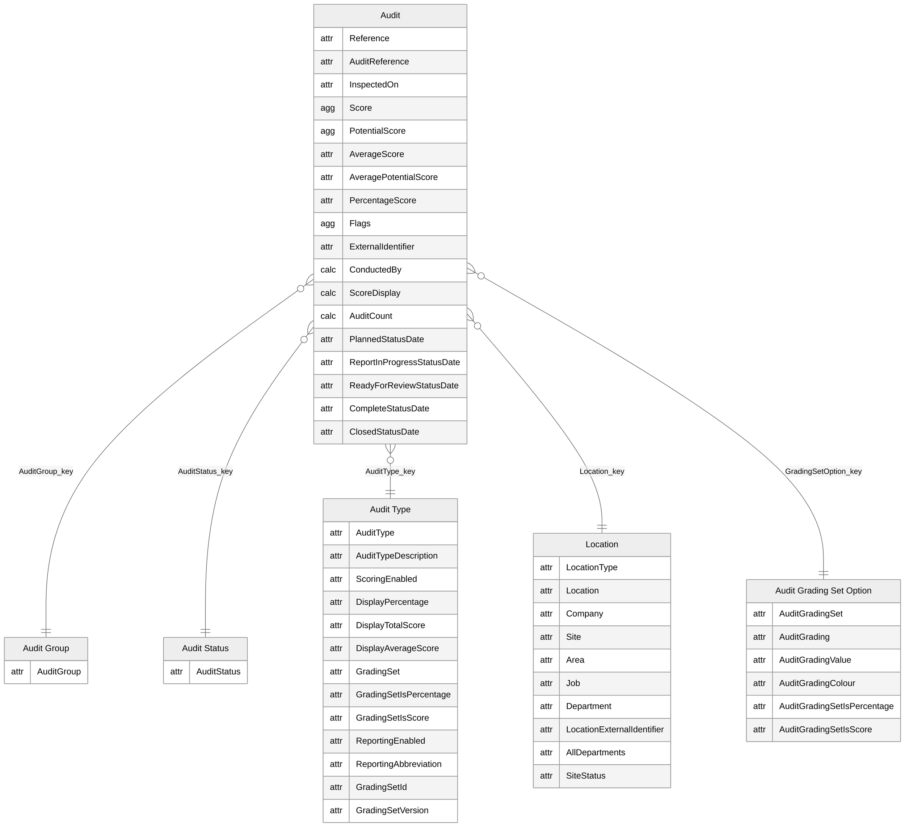
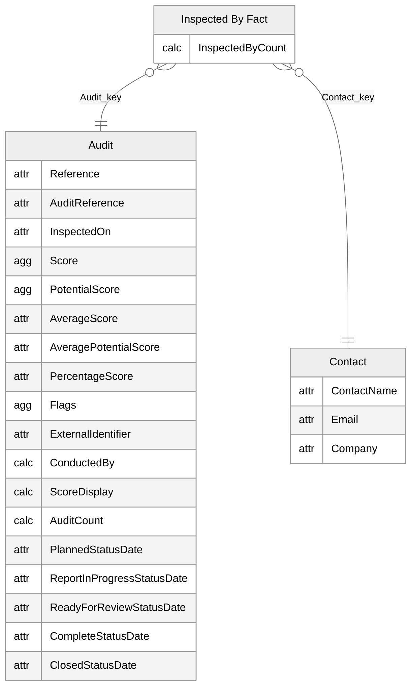
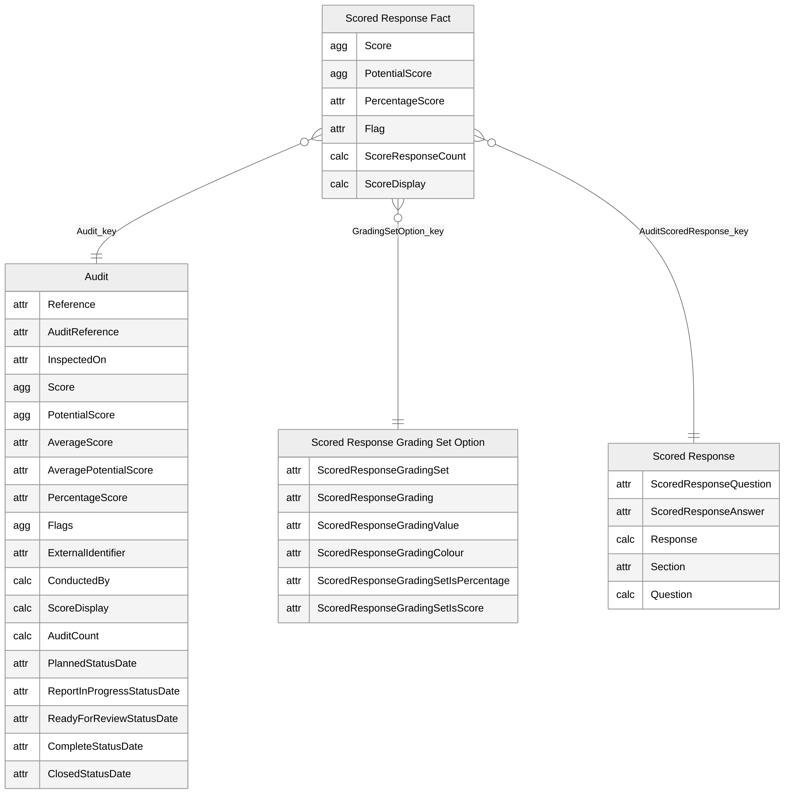
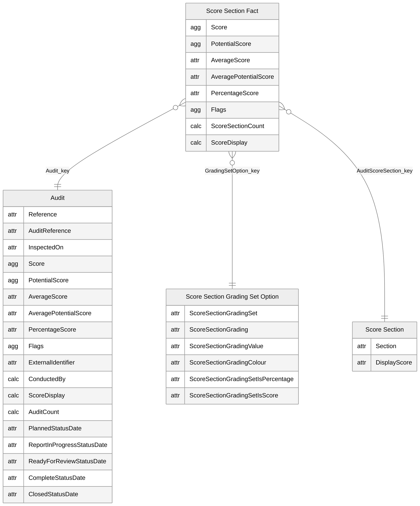
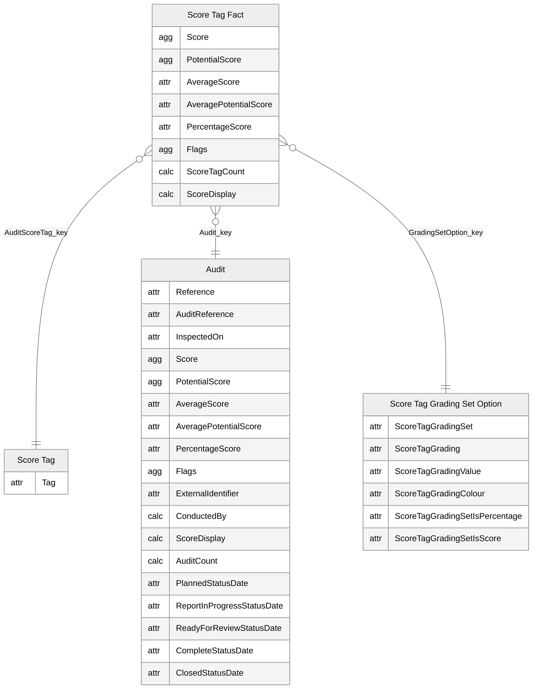
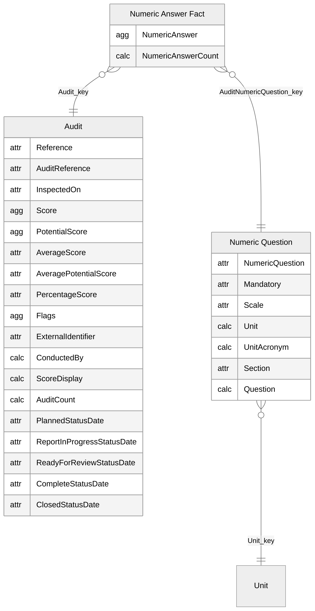
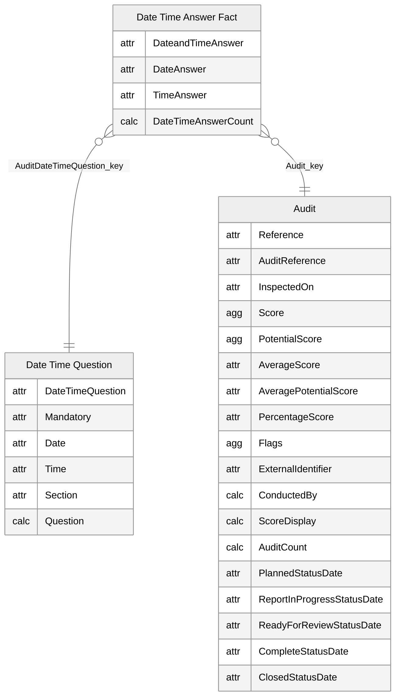
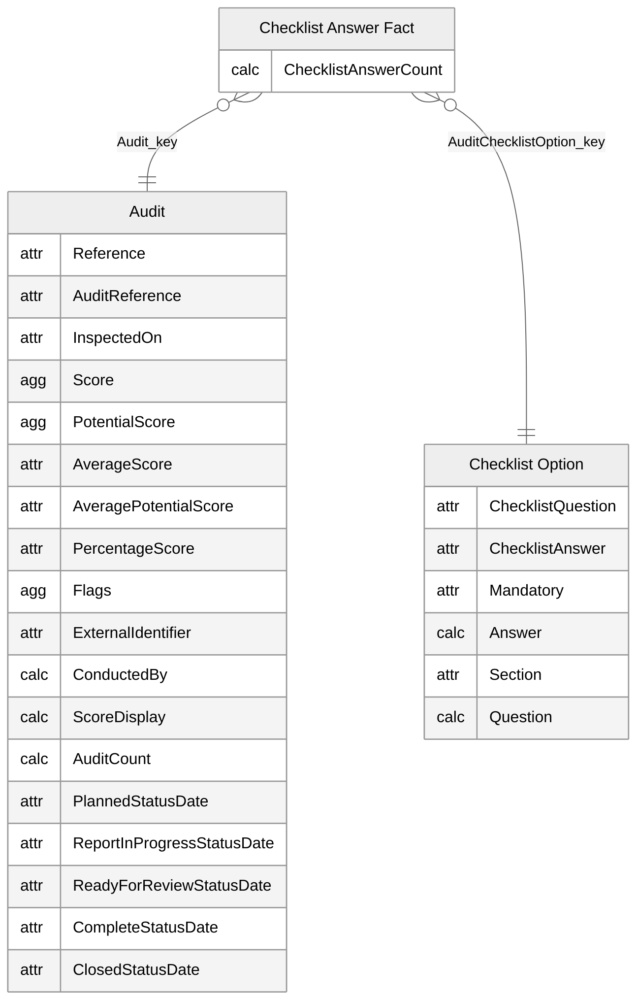
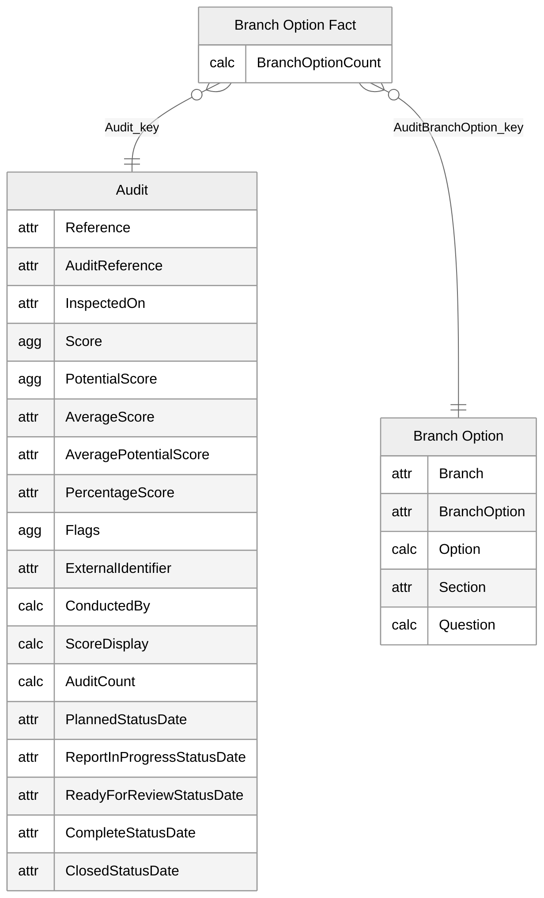

# Audits

[<- Back to index](../PowerBISamplesModels.md)

## Audits - Main

## Audits - Inspected By

## Audits - Scored Response

## Audits - Score Section

## Audits - Score Tag

## Audits - Numeric Answer

## Audits - Date Time Answer

## Audits - Checklist Answer

## Audits - Branch Option

