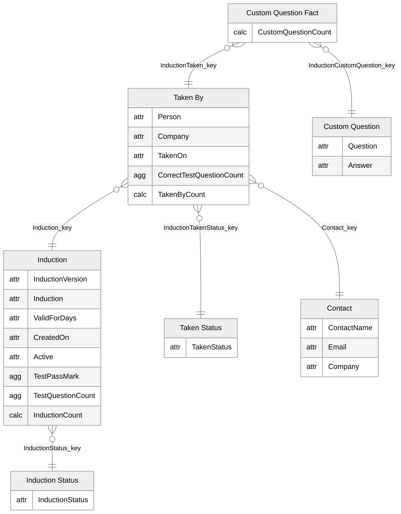

# Inductions

[<- Back to index](../PowerBISamplesModels.md)

## Inductions - Main

```mermaid
---
config:
  theme: neutral
  er:
    useMaxWidth: false
---
erDiagram
    "Induction" {
        attr InductionVersion
        attr Induction
        attr ValidForDays
        attr CreatedOn
        attr Active
        agg TestPassMark
        agg TestQuestionCount
        calc InductionCount
    }
    "Taken By" {
        attr Person
        attr Company
        attr TakenOn
        agg CorrectTestQuestionCount
        calc TakenByCount
    }
    "Taken Status" {
        attr TakenStatus
    }
    "Induction Status" {
        attr InductionStatus
    }
    "Custom Question Fact" {
        calc CustomQuestionCount
    }
    "Custom Question" {
        attr Question
        attr Answer
    }
    "Contact" {
        attr ContactName
        attr Email
        attr Company
    }
    "Induction" }o--|| "Induction Status" : "InductionStatus_key"
    "Custom Question Fact" }o--|| "Custom Question" : "InductionCustomQuestion_key"
    "Custom Question Fact" }o--|| "Taken By" : "InductionTaken_key"
    "Taken By" }o--|| "Induction" : "Induction_key"
    "Taken By" }o--|| "Taken Status" : "InductionTakenStatus_key"
    "Taken By" }o--|| "Contact" : "Contact_key"
```
