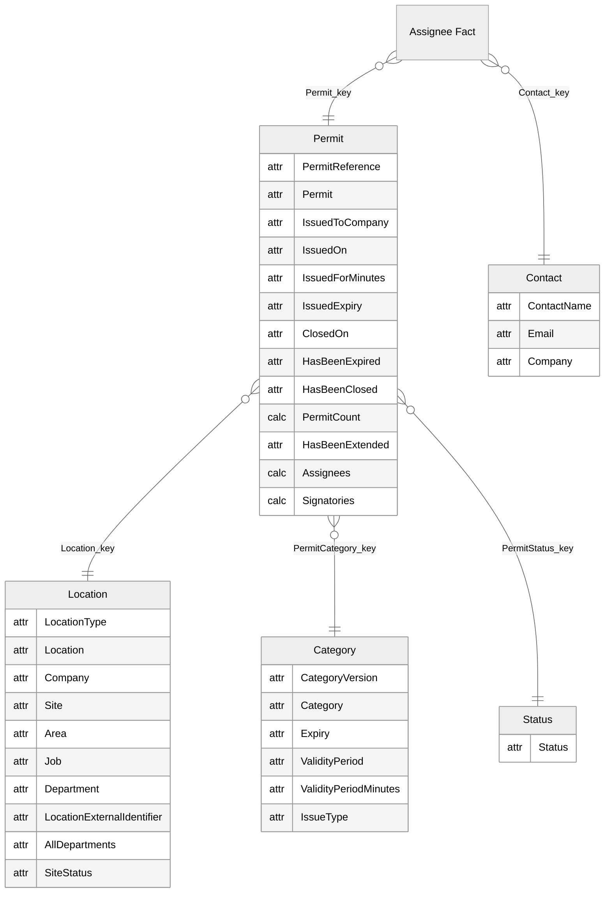
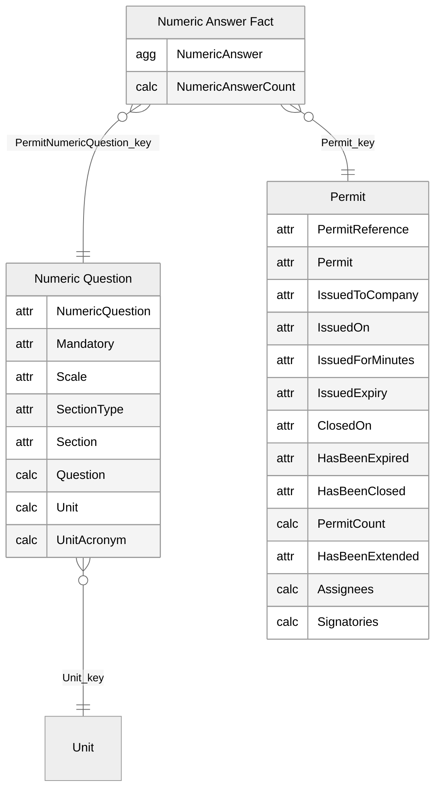
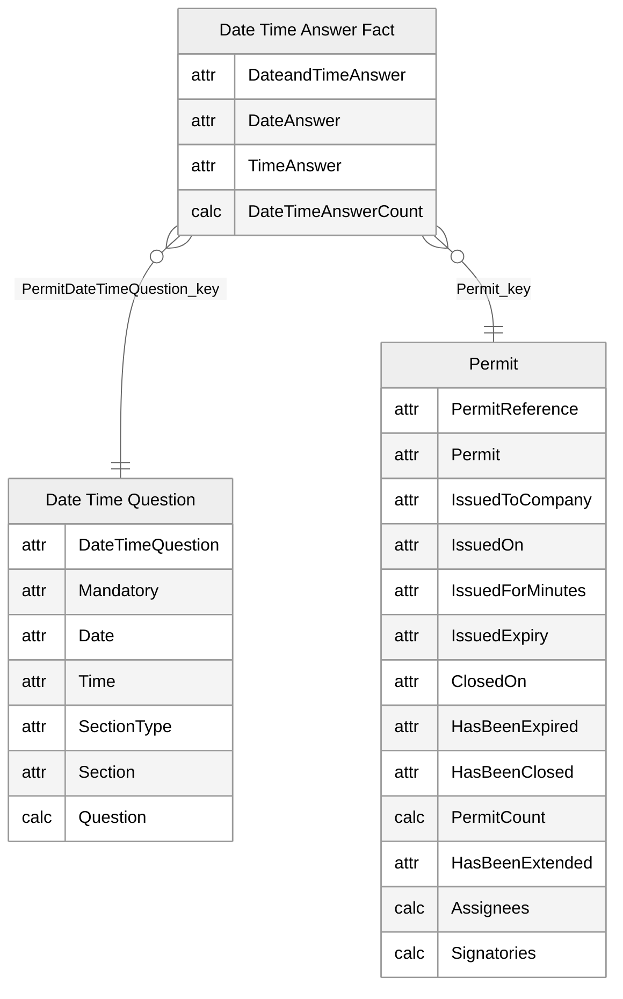
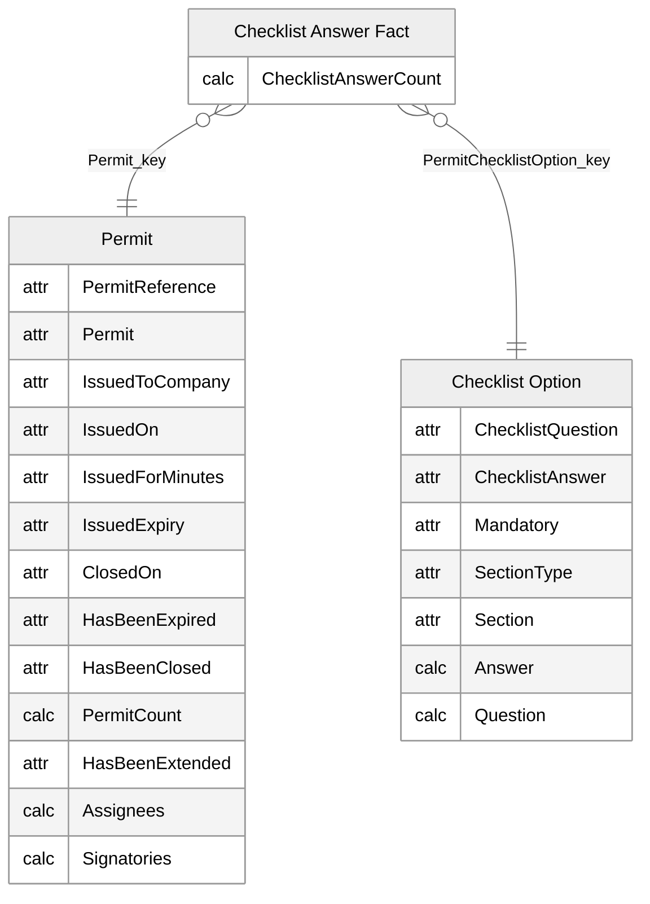
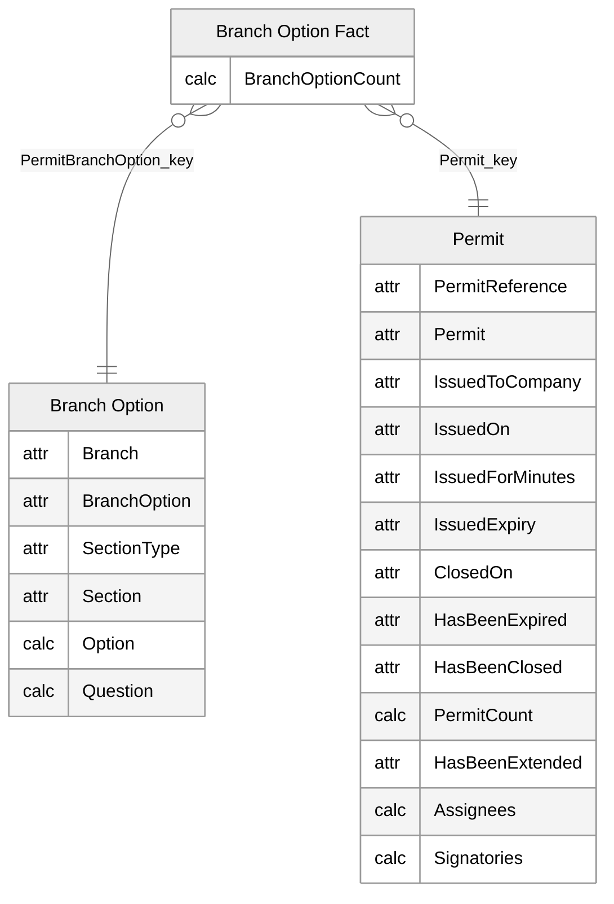
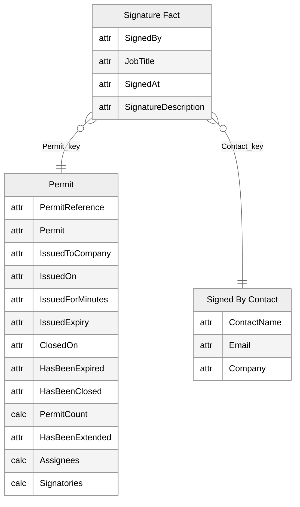

# Permits

[<- Back to index](../PowerBISamplesModels.md)

## Permits - Main

## Permits - Numeric Answer

## Permits - Date Time Answer

## Permits - Checklist Answer

## Permits - Branch Option

## Permits - Signed By

