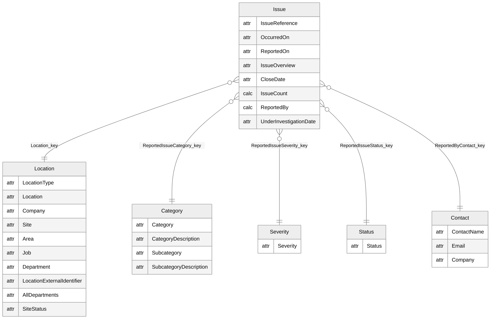
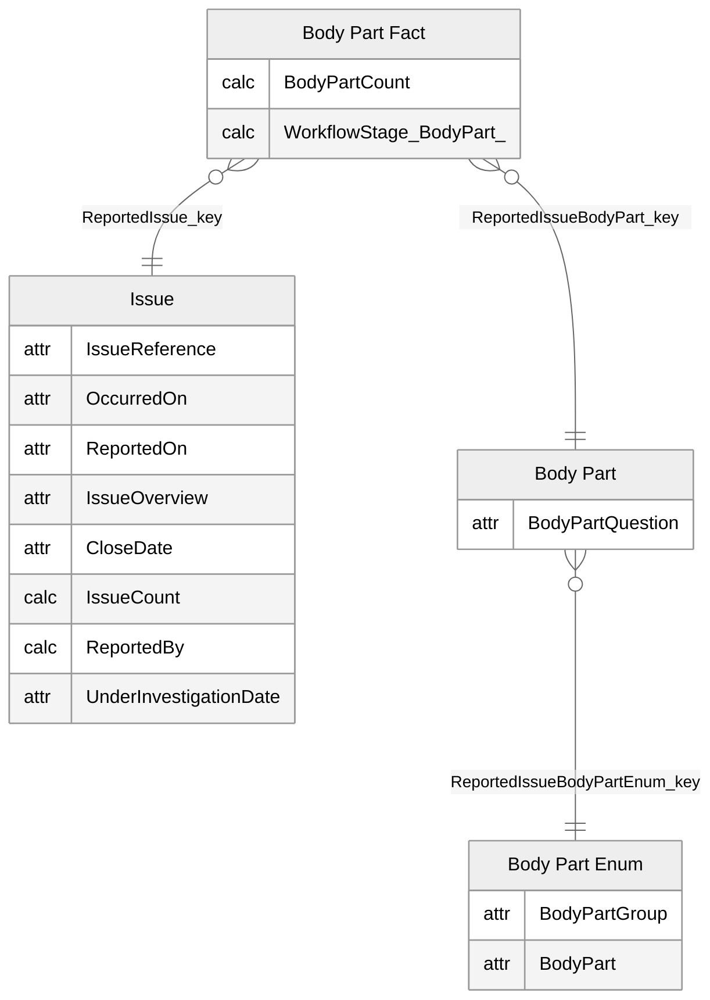
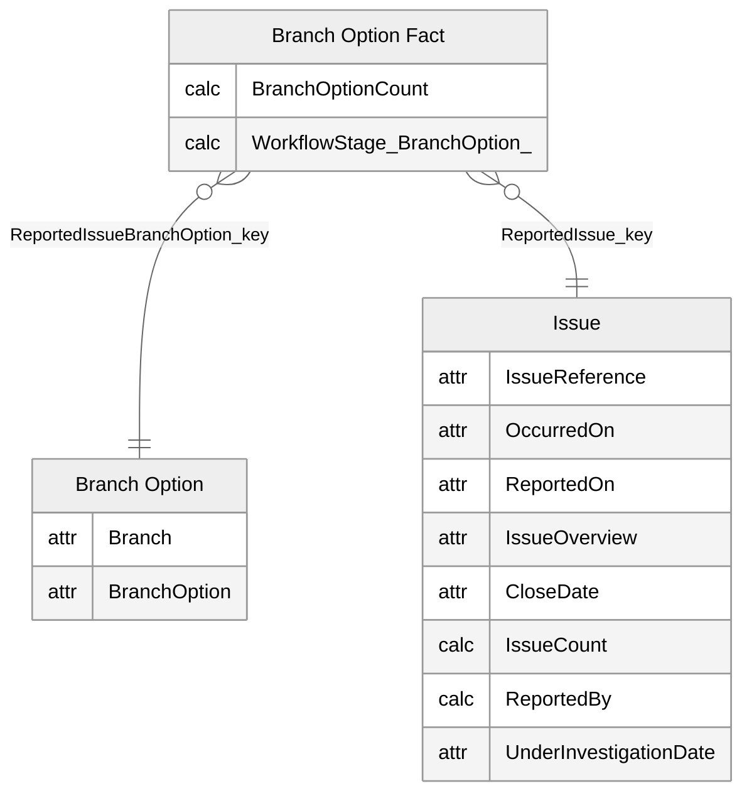
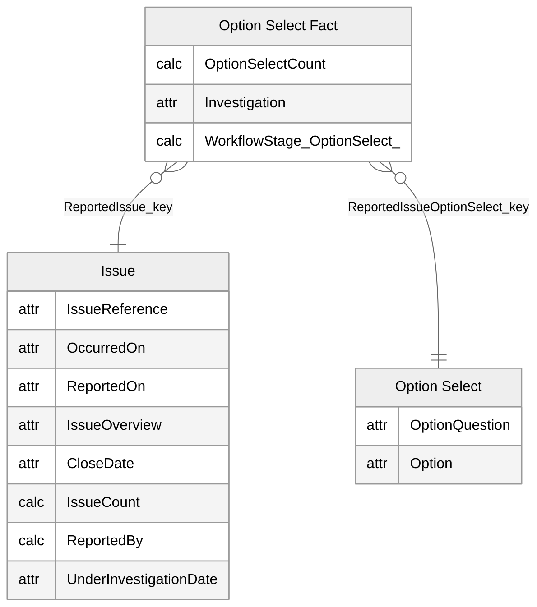
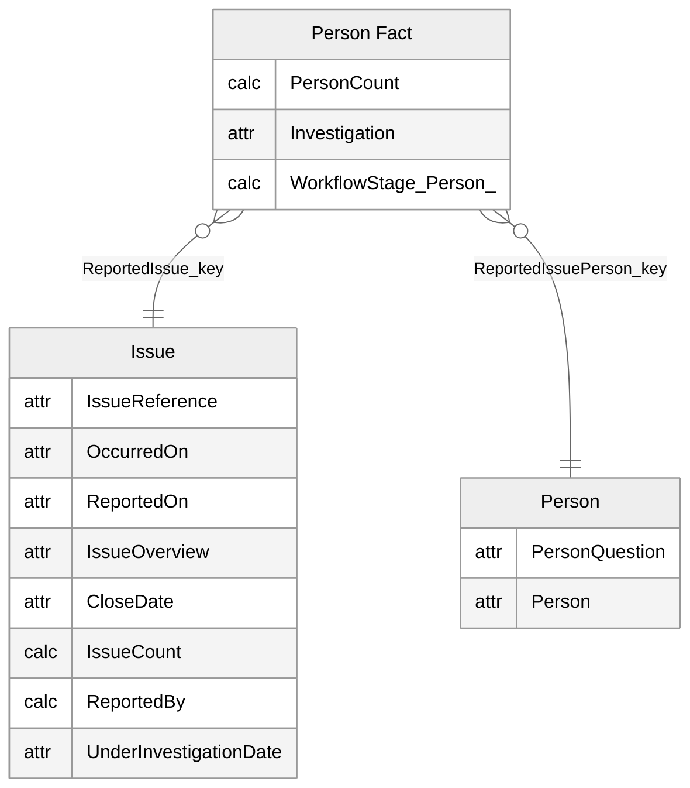
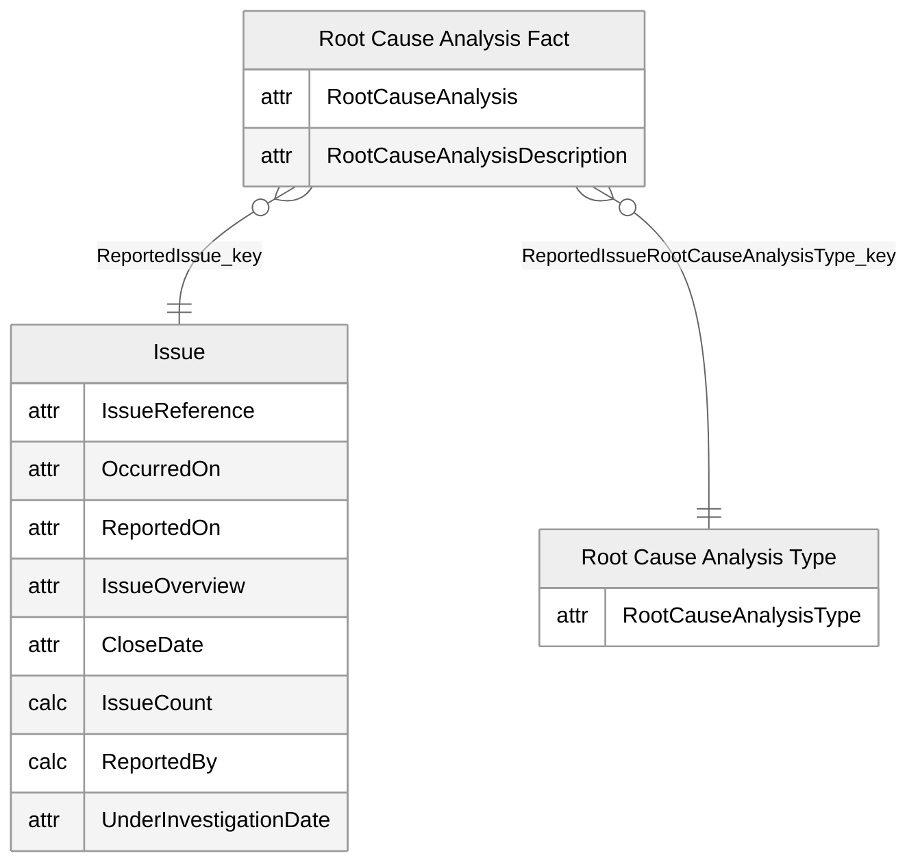
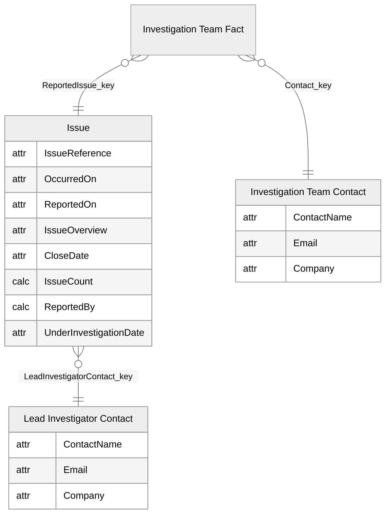

# Reported Issues

[<- Back to index](../PowerBISamplesModels.md)

## Reported Issues - Main

## Reported Issues - Body Part

## Reported Issues - Branch Option

## Reported Issues - Option Select

## Reported Issues - Person

## Reported Issues - Root Cause Analysis

## Reported Issues - Investigation Team

