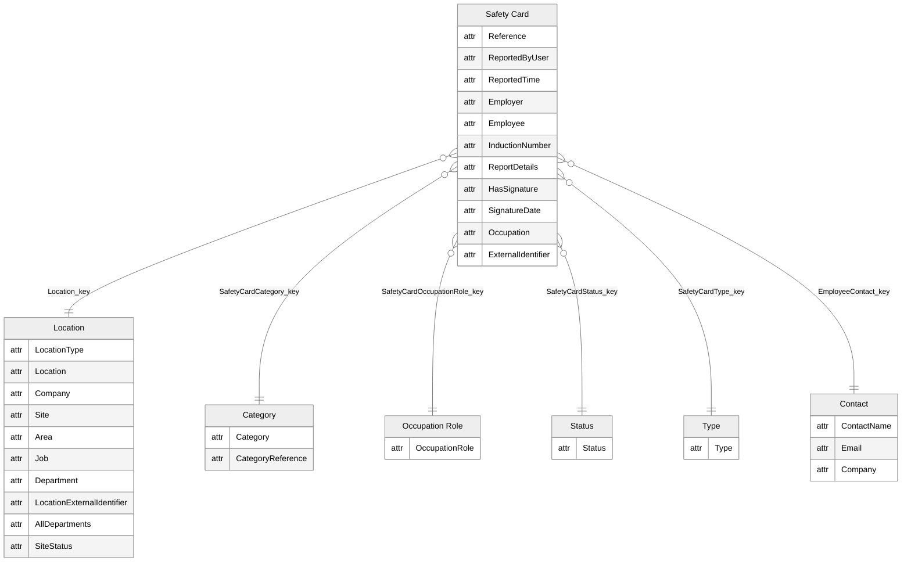

# Safety Cards

[<- Back to index](../PowerBISamplesModels.md)

## Safety Cards - Main

```mermaid
---
config:
  theme: neutral
---
erDiagram
    "Safety Card" {
        attr Reference
        attr ReportedByUser
        attr ReportedTime
        attr Employer
        attr Employee
        attr InductionNumber
        attr ReportDetails
        attr HasSignature
        attr SignatureDate
        attr Occupation
        attr ExternalIdentifier
    }
    "Location" {
        attr LocationType
        attr Location
        attr Company
        attr Site
        attr Area
        attr Job
        attr Department
        attr LocationExternalIdentifier
        attr AllDepartments
        attr SiteStatus
    }
    "Status" {
        attr Status
    }
    "Type" {
        attr Type
    }
    "Category" {
        attr Category
        attr CategoryReference
    }
    "Occupation Role" {
        attr OccupationRole
    }
    "Contact" {
        attr ContactName
        attr Email
        attr Company
    }
    "Safety Card" }o--|| "Location" : "Location_key"
    "Safety Card" }o--|| "Category" : "SafetyCardCategory_key"
    "Safety Card" }o--|| "Occupation Role" : "SafetyCardOccupationRole_key"
    "Safety Card" }o--|| "Status" : "SafetyCardStatus_key"
    "Safety Card" }o--|| "Type" : "SafetyCardType_key"
    "Safety Card" }o--|| "Contact" : "EmployeeContact_key"
```
