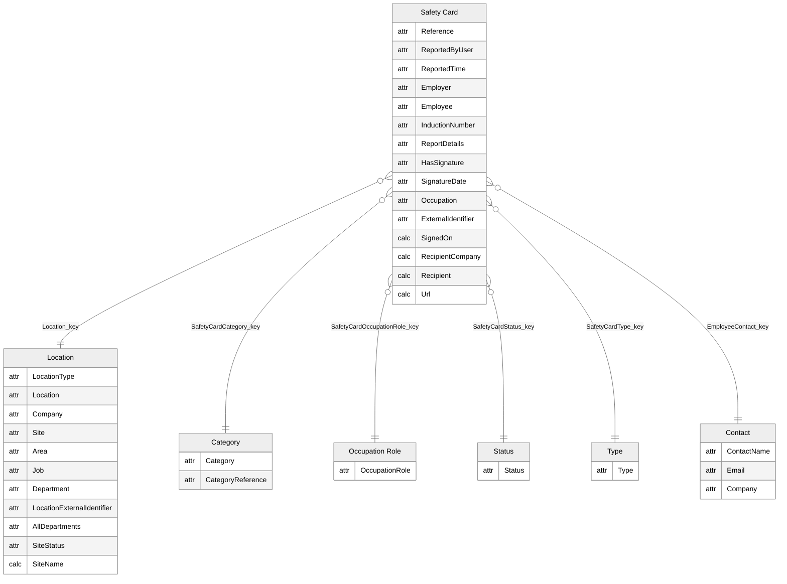
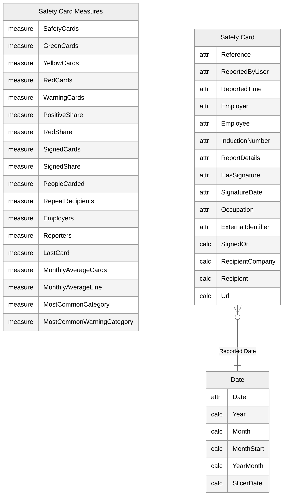
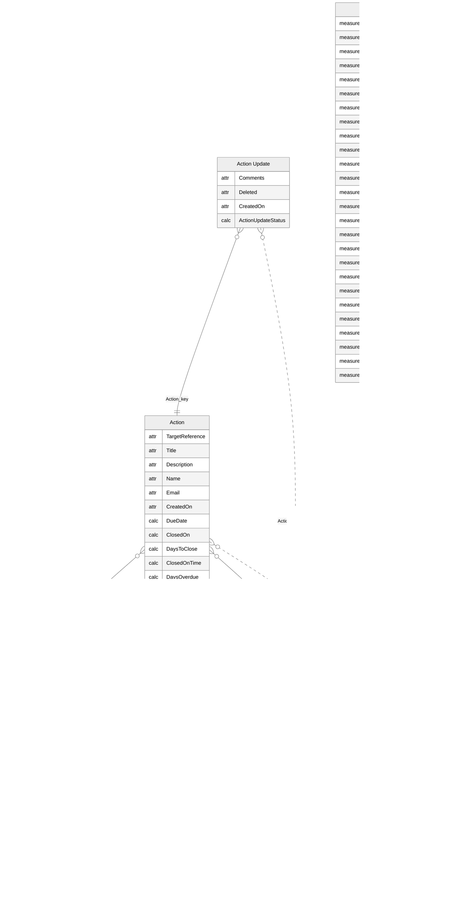

# Safety Cards

[<- Back to index](../PowerBISamplesModels.md)

## Safety Cards - Main

```mermaid
---
config:
  theme: neutral
---
erDiagram
    "Safety Card" {
        attr Reference
        attr ReportedByUser
        attr ReportedTime
        attr Employer
        attr Employee
        attr InductionNumber
        attr ReportDetails
        attr HasSignature
        attr SignatureDate
        attr Occupation
        attr ExternalIdentifier
        calc SignedOn
        calc RecipientCompany
        calc Recipient
        calc Url
    }
    "Location" {
        attr LocationType
        attr Location
        attr Company
        attr Site
        attr Area
        attr Job
        attr Department
        attr LocationExternalIdentifier
        attr AllDepartments
        attr SiteStatus
        calc SiteName
    }
    "Status" {
        attr Status
    }
    "Type" {
        attr Type
    }
    "Category" {
        attr Category
        attr CategoryReference
    }
    "Occupation Role" {
        attr OccupationRole
    }
    "Contact" {
        attr ContactName
        attr Email
        attr Company
    }
    "Safety Card" }o--|| "Location" : "Location_key"
    "Safety Card" }o--|| "Category" : "SafetyCardCategory_key"
    "Safety Card" }o--|| "Occupation Role" : "SafetyCardOccupationRole_key"
    "Safety Card" }o--|| "Status" : "SafetyCardStatus_key"
    "Safety Card" }o--|| "Type" : "SafetyCardType_key"
    "Safety Card" }o--|| "Contact" : "EmployeeContact_key"
```

## Safety Cards - Date and measures

```mermaid
---
config:
  theme: neutral
---
erDiagram
    "Date" {
        attr Date
        calc Year
        calc Month
        calc MonthStart
        calc YearMonth
        calc SlicerDate
    }
    "Safety Card Measures" {
        measure SafetyCards
        measure GreenCards
        measure YellowCards
        measure RedCards
        measure WarningCards
        measure PositiveShare
        measure RedShare
        measure SignedCards
        measure SignedShare
        measure PeopleCarded
        measure RepeatRecipients
        measure Employers
        measure Reporters
        measure LastCard
        measure MonthlyAverageCards
        measure MonthlyAverageLine
        measure MostCommonCategory
        measure MostCommonWarningCategory
    }
    "Safety Card" {
        attr Reference
        attr ReportedByUser
        attr ReportedTime
        attr Employer
        attr Employee
        attr InductionNumber
        attr ReportDetails
        attr HasSignature
        attr SignatureDate
        attr Occupation
        attr ExternalIdentifier
        calc SignedOn
        calc RecipientCompany
        calc Recipient
        calc Url
    }
    "Safety Card" }o--|| "Date" : "Reported Date"
```

## Safety Cards - Actions

```mermaid
---
config:
  theme: neutral
---
erDiagram
    "Action Update" {
        attr Comments
        attr Deleted
        attr CreatedOn
        calc ActionUpdateStatus
    }
    "Action" {
        attr TargetReference
        attr Title
        attr Description
        attr Name
        attr Email
        attr CreatedOn
        calc DueDate
        calc ClosedOn
        calc DaysToClose
        calc ClosedOnTime
        calc DaysOverdue
        calc OverdueBand
        calc Assignee
        calc Url
    }
    "Action Status" {
        attr ActionStatus
    }
    "Action Priority" {
        attr ActionPriority
    }
    "Action Date" {
        attr Date
        calc Year
        calc Month
        calc MonthStart
        calc YearMonth
        calc SlicerDate
    }
    "Safety Card" {
        attr Reference
        attr ReportedByUser
        attr ReportedTime
        attr Employer
        attr Employee
        attr InductionNumber
        attr ReportDetails
        attr HasSignature
        attr SignatureDate
        attr Occupation
        attr ExternalIdentifier
        calc SignedOn
        calc RecipientCompany
        calc Recipient
        calc Url
    }
    "Action Measures" {
        measure Actions
        measure OpenActions
        measure ClosedActions
        measure DraftActions
        measure OverdueActions
        measure SeriousOverdueActions
        measure SeriousOpenActions
        measure AverageDaysOverdue
        measure OldestOverdueDays
        measure ActionsWithoutDueDate
        measure SafetyCardOpenActions
        measure Assignees
        measure MonthlyAverageActions
        measure MonthlyAverageActionsLine
        measure MostOverdueAssignee
        measure ActionsClosed
        measure AverageDaysToClose
        measure ClosedOnTime
        measure ClosedWithDueDate
        measure OnTimeRate
        measure ClosureRate
        measure Updates
        measure ActionsWithUpdates
        measure AverageCloseOutDays
        measure SafetyCardsWithActions
        measure SafetyCardsWithOpenActions
    }
    "Action" }o--|| "Safety Card" : "SafetyCard_key"
    "Action" }o--|| "Action Priority" : "ActionPriority_key"
    "Action" }o--|| "Action Status" : "ActionStatus_key"
    "Action Update" }o--|| "Action" : "Action_key"
    "Action Update" }o..|| "Action Status" : "ActionStatus_key"
    "Action" }o--|| "Action Date" : "Raised Date"
    "Action" }o..|| "Action Date" : "Closed Date"
```
