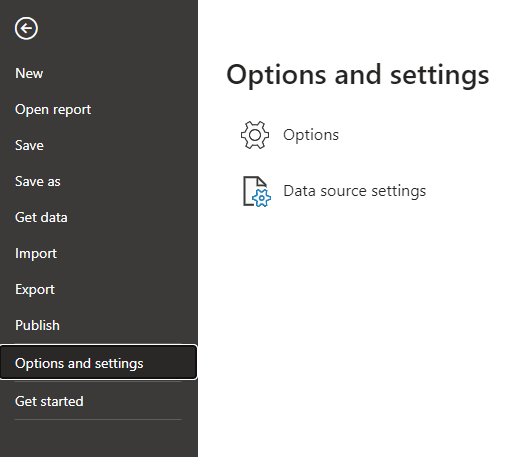
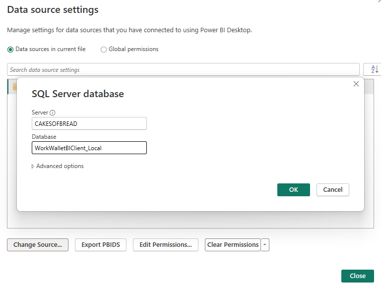
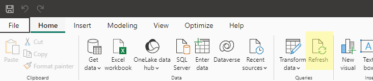

# Work Wallet Business Intelligence (BI) Client

A streamlined, production-ready reference implementation for extracting Health & Safety data from the Work Wallet BI Extract API into a local/star-schema SQL Server data mart, with optional scheduling (console or Azure Function) and sample Power BI semantic models.

---

## Contents

1. [Overview](#1-overview)
   - 1.1 [Why This Exists](#11-why-this-exists)
2. [Supported Datasets](#2-supported-datasets)
3. [Usage Paths](#3-usage-paths)
4. [API Credentials](#4-api-credentials)
5. [Quick Start (Database + Power BI Path)](#5-quick-start-database--power-bi-path)
   - 5.1 [Binaries / Downloads](#51-binaries--downloads)
   - 5.2 [Prerequisites](#52-prerequisites)
   - 5.3 [Architecture](#53-architecture)
   - 5.4 [Repository Structure](#54-repository-structure)
   - 5.5 [Database Deployment](#55-database-deployment)
   - 5.6 [Data Extraction (Console)](#56-data-extraction-console)
   - 5.7 [Azure Function Deployment](#57-azure-function-deployment)
   - 5.8 [Force Data Reset](#58-force-data-reset)
   - 5.9 [Power BI Samples](#59-power-bi-samples)
   - 5.10 [Troubleshooting](#510-troubleshooting)
   - 5.11 [Security Notes](#511-security-notes)
6. [Direct API Usage (No Database)](#6-direct-api-usage-no-database)
   - 6.1 [Obtain an OAuth 2.0 Access Token](#61-obtain-an-oauth-20-access-token)
   - 6.2 [Call the BI Extract Endpoint (Paging)](#62-call-the-bi-extract-endpoint-paging)
   - 6.3 [Change Tracking](#63-change-tracking)
   - 6.4 [Idempotency Considerations](#64-idempotency-considerations)
   - 6.5 [Example (Truncated JSON)](#65-example-truncated-json)
   - 6.6 [Unpacking the JSON](#66-unpacking-the-json)
   - 6.7 [Multi-Region Access](#67-multi-region-access)
   - 6.8 [Error Handling](#68-error-handling)
   - 6.9 [When to Use the Quick Start Instead](#69-when-to-use-the-quick-start-instead)
7. [Contributing / Issues](#7-contributing--issues)
8. [License](#8-license)
9. [Changelog](#9-changelog)

---

## 1. Overview

The [Work Wallet](https://www.work-wallet.com/) Health & Safety platform exposes a secure BI Extract API optimised for regular, incremental data feeds into analytics platforms. This repository provides:

Repository (source & releases): [work-wallet/BIClient](https://github.com/work-wallet/BIClient)

- A ready-made SQL Server data mart (star schema) and deployment tool
- A robust, paged, change-tracking extraction client (console + Azure Function)
- Sample Power BI project (.pbip) files with semantic models & reports
- Extensible, strongly-typed .NET 8 code you can adopt or adapt

You can use the binaries directly (no code changes required), customise the solution, or treat it as a reference implementation for your own stack.

### 1.1 Why This Exists

Many organisations need timely Health & Safety operational insight (issues raised, audits, permits, actions) but lack a ready-made ingestion pattern. Building robust paging, incremental change tracking and schema management from scratch is repetitive and error-prone. This project provides:

- A proven extraction + persistence pattern (paged, resilient, incremental)
- A normalised → star-schema transformation with dimensional consistency
- Sample semantic models to accelerate analytics consumption
- Clear extension points so you can swap storage, add datasets or integrate into existing orchestration

Use it to accelerate your first production deployment, then iterate where you differentiate (governance, advanced modelling, ML, etc.).

## 2. Supported Datasets

The API currently enables download of:

- Actions
- Audits
- Assets
- Inductions
- Permits
- PPE (three modules):
  - PPEAssignments
  - PPEStockHistories
  - PPEStocks
- Reported Issues
- Safety Cards

Each dataset is queried using paging + `lastSynchronizationVersion` change tracking to minimise transfer volume.

## 3. Usage Paths

Choose the approach that best fits your analytics platform maturity:

| Path | When to Use | Outputs | Effort |
| --- | --- | --- | --- |
| [Quick Start (recommended)](#5-quick-start-database--power-bi-path) | You want an end‑to‑end working pipeline fast | Deployed SQL star schema + optional Power BI models | Minimal configuration |
| [Direct API (no database)](#6-direct-api-usage-no-database) | You already have existing data integration or lake tooling | Raw paged JSON responses | Build paging + change tracking logic |

If unsure, start with the Quick Start; you can later migrate to a bespoke ingestion using the same credentials.

## 4. API Credentials

Access is enabled per Wallet. Contact Work Wallet Support to request activation. You will receive:

- `ApiAccessClientId`
- `ApiAccessClientSecret`
- `WalletId`
- `WalletSecret`

Base endpoints:

- API: `https://bi.work-wallet.com`
- Auth: `https://identity.work-wallet.com`

These values are required for both the Quick Start and Direct API usage.

## 5. Quick Start (Database + Power BI Path)

1. Request API credentials.
2. Download latest release binaries (database deploy + client) from [Releases](https://github.com/work-wallet/BIClient/releases).
3. Deploy / upgrade the database (edit `WorkWallet.BI.ClientDatabaseDeploy/appsettings.json` then run `WorkWallet.BI.ClientDatabaseDeploy.exe`).
4. Configure data extraction (edit `WorkWallet.BI.ClientSample/appsettings.json` then run the executable — first run is a full load).
5. Set up automated extraction:
   - **Either**: Schedule `WorkWallet.BI.ClientSample.exe` to run regularly (daily recommended)
   - **Or**: Deploy `WorkWallet.BI.ClientFunction` for Azure-hosted automation
6. (Optional) Open a Power BI sample `.pbip` project from `PowerBISamples`, point to your database, refresh.
7. (Optional) Publish Power BI reports to Power BI Pro / Fabric for sharing and scheduled refresh.

### 5.1 Binaries / Downloads

All binaries target .NET 8. Install the [.NET 8 runtime](https://dotnet.microsoft.com/en-us/download/dotnet/8.0) if not already present.

Download from GitHub [Releases](https://github.com/work-wallet/BIClient/releases) (or build from source):

| Tool | Executable | Config File |
| --- | --- | --- |
| Database Deployment | `WorkWallet.BI.ClientDatabaseDeploy.exe` | `appsettings.json` |
| Data Extraction (Console) | `WorkWallet.BI.ClientSample.exe` | `appsettings.json` |

### 5.2 Prerequisites

You should be comfortable with basic SQL Server administration and .NET runtime deployment.

Required:

- SQL Server (Azure SQL, LocalDB, Express, Developer, Standard, etc.)
- A SQL connection string compatible with `Microsoft.Data.SqlClient`
- Internet access (firewall allows: `bi.work-wallet.com`, `identity.work-wallet.com`)
- .NET 8 runtime (for running) or SDK (if building from source)

Optional:

- Visual Studio 2022 (or `dotnet` CLI) to modify/build
- Power BI Desktop (for provided sample models)
- Azure Subscription (if using Azure Functions)

### 5.3 Architecture

Understanding how the components work together helps when configuring and troubleshooting the solution:

**Data Flow Overview:**

1. **Authentication**: The client obtains OAuth2 bearer tokens using your API credentials from `https://identity.work-wallet.com`
2. **API Extraction**: Makes paged requests to `https://bi.work-wallet.com/dataextract/{dataset}` (configurable page size, max 500)
3. **Change Tracking**: Uses `lastSynchronizationVersion` to fetch only new/changed data since the last run
4. **Database Loading**: JSON responses are parsed and loaded into SQL Server via stored procedures
5. **Star Schema**: Data is transformed into fact and dimension tables optimized for analytics

**Key Design Principles:**

- **Incremental**: Only fetches changes since last successful sync (stored in `mart.ETL_ChangeDetection`)
- **Resilient**: Handles network issues, API limits, and partial failures gracefully
- **Scalable**: Supports multiple wallets via `AgentWallets[]` configuration array
- **Extensible**: Clear extension points for custom business logic and alternative storage

**Why This Approach:**

- Minimizes API load and transfer time with paging + change tracking
- Provides analytics-ready star schema out of the box
- Handles the complexity of robust incremental sync patterns
- Separates extraction logic from transformation logic for maintainability

### 5.4 Repository Structure

| Project | Purpose |
| --- | --- |
| `WorkWallet.BI.ClientDatabaseDeploy` | Deploys / upgrades schema, types & stored procedures (drops + recreates procs on upgrade). |
| `WorkWallet.BI.ClientSample` | Console data extraction client (manual / scheduled). |
| `WorkWallet.BI.ClientFunction` | Azure Function timer-trigger wrapper for automated extraction. |
| `WorkWallet.BI.ClientCore` | Shared abstractions & options. |
| `WorkWallet.BI.ClientServices` | HTTP + data store implementations, processor logic. |
| `PowerBISamples` | `.pbip` models & reports (one per dataset). |
| `Images` | Screenshots (used in documentation). |
| `Scripts` | Legacy migration script. |

### 5.5 Database Deployment

Executable: `WorkWallet.BI.ClientDatabaseDeploy`.

1. Edit `appsettings.json` → set: `AppSettings:DatabaseConnectionString`.
2. Run `WorkWallet.BI.ClientDatabaseDeploy.exe` – creates the database if absent and applies migrations (drops & recreates stored procedures in `mart` schema intentionally).

Example `appsettings.json` placed alongside the executable:

```json
{
  "AppSettings": {
    "DatabaseConnectionString": "Server=(localdb)\\MSSQLLocalDB;Database=WorkWalletBIClient;Integrated Security=true"
  },
  "Logging": {
    "LogLevel": {
      "Default": "Information",
      "Microsoft": "Warning"
    }
  }
}
```

#### 5.5.1 Legacy Installations (Pre-Aug 2023)

Most users can skip this section.

If you originally stood up the database manually before August 2023 your schema will be missing the tracking table `dbo.SchemaVersions` used by the deployment tool to know which one-time scripts have already been applied. Running the deployment tool without seeding this table could cause it to (re)apply scripts incorrectly.

To remediate:

1. Take a backup of the existing database (recommended).
2. Open the script `Scripts/InitialiseSchemaVersions.sql` and review its contents.
3. Execute it against the target database (e.g. in SQL Server Management Studio or `sqlcmd`). It inserts baseline rows representing the current state.
4. Run `WorkWallet.BI.ClientDatabaseDeploy.exe` normally.

Why this is needed: the deployment tool records each RunOnce group (schema objects) in `dbo.SchemaVersions`. Older manual installs pre-date that mechanism. Seeding prevents duplicate creation attempts and ensures future upgrades run only delta logic.

Alternative: If a full reload is acceptable you may instead create a fresh empty database, run the deployment tool (which will create `dbo.SchemaVersions` automatically) and then perform a full data extraction.

#### 5.5.2 Extension Points for Custom Business Logic

The database deployment includes empty placeholder stored procedures named `mart.ETL_PostProcess*` (one for each dataset: Actions, Assets, Audits, etc.). These are intentional extension points where you can implement custom business logic that runs after each dataset is loaded.

**Important:** All `mart.*` stored procedures are dropped and recreated when `WorkWallet.BI.ClientDatabaseDeploy` runs. Any changes you make directly to these procedures will be lost on the next database update.

**Recommended Approach:** If you need to implement custom post-processing logic:

1. **Clone this repository** to your own source control
2. **Modify the `ETL_PostProcess*` procedures** in your cloned version with your custom business logic
3. **Keep your fork current** by regularly pulling updates from the upstream repository
4. **Deploy using your modified version** of `WorkWallet.BI.ClientDatabaseDeploy`

Example scenarios for custom post-processing:

- Additional transformations or calculations

The post-process procedures are called automatically after each dataset load completes successfully.

### 5.6 Data Extraction (Console)

Executable: `WorkWallet.BI.ClientSample`.

Edit `appsettings.json` (key fields shown):

| Path | Description |
| --- | --- |
| `ClientOptions:ApiAccessClientId` | OAuth2 client id |
| `ClientOptions:ApiAccessClientSecret` | OAuth2 client secret |
| `ClientOptions:AgentWallets:[n]:WalletId` | Wallet identifier (repeatable) |
| `ClientOptions:AgentWallets:[n]:WalletSecret` | Wallet secret (repeatable) |
| `ClientOptions:DataSets[]` | Array of datasets to pull (see list above) |
| `ConnectionStrings:ClientDb` | SQL connection string |

Example `appsettings.json` placed alongside `WorkWallet.BI.ClientSample.exe`:

```json
{
  "ClientOptions": {
    "ApiAccessAuthority": "https://identity.work-wallet.com",
    "ApiAccessClientId": "[required]",
    "ApiAccessClientSecret": "[required]",
    "ApiAccessScope": "ww_bi_extract",
    "AgentApiUrl": "https://bi.work-wallet.com",
    "AgentWallets": [
      {
        "WalletId": "[required]",
        "WalletSecret": "[required]"
      }
    ],
    "AgentPageSize": "500",
    "DataSets": [
      "Actions",
      "Audits",
      "Assets",
      "Inductions",
      "Permits",
      "PPEAssignments",
      "PPEStockHistories",
      "PPEStocks",
      "ReportedIssues",
      "SafetyCards"
    ]
  },
  "ConnectionStrings": {
    "ClientDb": "Server=(localdb)\\MSSQLLocalDB;Database=WorkWalletBIClient;Integrated Security=true"
  },
  "Logging": {
    "LogLevel": {
      "Default": "Warning",
      "Microsoft": "Warning",
      "WorkWallet.BI.ClientServices.Processor.ProcessorService": "Information",
      "WorkWallet.BI.ClientServices.DataStore.SQLService": "Information"
    }
  }
}
```

Run the executable manually or schedule (Task Scheduler / cron / etc.).

#### 5.6.1 Scheduling Recommendations

For automated runs, schedule the executable to run outside core working hours to avoid conflicts with active data entry. Run regularly (typically daily) to prevent the `Invalid lastSynchronizationVersion` error caused by synchronization gaps exceeding retention periods.

Choose a slightly randomized time within your out-of-hours window (e.g., 2:17 AM instead of 2:00 AM) to distribute API load and avoid request bunching.

#### 5.6.2 Notes

- First run performs full historical load (may be large).
- Incremental loads fetch only changed pages per dataset.
- Progress & change tracking stored in `mart.ETL_ChangeDetection`.
- Configure multiple wallets by adding more objects to `AgentWallets[]`.

Error `Invalid lastSynchronizationVersion`: usually means extraction gap exceeded retention. Resolve by [5.8 Force Data Reset](#58-force-data-reset).

### 5.7 Azure Function Deployment

Project: `WorkWallet.BI.ClientFunction` (timer trigger).

Recommended host creation settings:

- Runtime stack: .NET 8 (Isolated)
- OS: Windows
- Application Insights: Enabled

Key app settings:

| Setting | Example | Notes |
| --- | --- | --- |
| `BITimerTriggerSchedule` | `0 30 21 * * *` | NCRONTAB expression (UTC) |
| `FuncOptions:AgentApiUrl` | `https://bi.work-wallet.com` | Base API URL |
| `FuncOptions:AgentPageSize` | `500` | Max recommended 500 |
| `FuncOptions:AgentWallets:[0]:WalletId` | | Repeat per wallet |
| `FuncOptions:AgentWallets:[0]:WalletSecret` | |  |
| `FuncOptions:ApiAccessAuthority` | `https://identity.work-wallet.com` | Auth endpoint |
| `FuncOptions:ApiAccessClientId` | |  |
| `FuncOptions:ApiAccessClientSecret` | |  |
| `FuncOptions:ApiAccessScope` | `ww_bi_extract` | Scope constant |
| `sqldb_connection` | | SQL connection string |

Local development requires `local.settings.json`.
Include `APPLICATIONINSIGHTS_CONNECTION_STRING` if you want to see structured logs (some info-level events bypass console output).

Example `local.settings.json` for local Azure Function development:

```json
{
  "IsEncrypted": false,
  "Values": {
    "FUNCTIONS_WORKER_RUNTIME": "dotnet-isolated",
    "APPLICATIONINSIGHTS_CONNECTION_STRING": "[required]",
    "AzureWebJobsStorage": "UseDevelopmentStorage=true",
    "BITimerTriggerSchedule": "0 30 21 * * *",
    "FuncOptions:ApiAccessAuthority": "https://identity.work-wallet.com",
    "FuncOptions:ApiAccessClientId": "[required]",
    "FuncOptions:ApiAccessClientSecret": "[required]",
    "FuncOptions:ApiAccessScope": "ww_bi_extract",
    "FuncOptions:AgentApiUrl": "https://bi.work-wallet.com",
    "FuncOptions:AgentWallets:[0]:WalletId": "[required]",
    "FuncOptions:AgentWallets:[0]:WalletSecret": "[required]",
    "FuncOptions:AgentPageSize": "500",
    "sqldb_connection": "Server=(localdb)\\MSSQLLocalDB;Database=WorkWalletBIClient;Integrated Security=true"
  }
}
```

### 5.8 Force Data Reset

Mechanism: Delete relevant rows from `mart.ETL_ChangeDetection`. Next execution will:

1. Delete existing rows for that dataset’s tables.
2. Re-ingest all data.

Example (reset Audits dataset):

```sql
DELETE FROM mart.ETL_ChangeDetection WHERE LogType = 'AUDIT2_UPDATED';
```

| Dataset | LogType |
| --- | --- |
| Actions | ACTION_UPDATED |
| Assets | ASSET_UPDATED |
| Audits | AUDIT2_UPDATED |
| Inductions | INDUCTION_UPDATED |
| Permits | PERMIT_UPDATED |
| PPEAssignments | PPE_ASSIGNMENT_UPDATED |
| PPEStockHistories | PPE_STOCK_HISTORY_UPDATED |
| PPEStocks | PPE_STOCK_UPDATED |
| ReportedIssues | REPORTED_ISSUE_UPDATED |
| SafetyCards | SAFETY_CARD_UPDATED |

If large volumes make deletion slow, recreating the database + redeploying may be faster.

### 5.9 Power BI Samples

Sample Power BI Project files (`.pbip`) are located in `PowerBISamples/` (one folder per domain). These include both the semantic model and report definitions.

You may:

- Point them at your database (change data source)
- Refresh to populate visuals
- Customise measures, relationships, visuals

They are a reference only—any BI tool can consume the database.

For model diagrams see [`PowerBISamplesModels.md`](PowerBISamplesModels.md).

#### 5.9.1 Connect to Your Database

Power BI Desktop → File → Options and settings → Data source settings → Change Source...





#### 5.9.2 Refresh Data

Click Refresh (Home ribbon). Data is on-demand unless you publish to a service (Power BI Pro / Fabric) with scheduled refresh.



#### 5.9.3 Adjust Filters

Ensure any default filters (e.g. date, site, status) reflect values present in your Wallet or visuals may appear blank.

### 5.10 Troubleshooting

| Symptom | Cause | Resolution |
| --- | --- | --- |
| `Invalid lastSynchronizationVersion` | Gap too long / table reset mismatch | Perform [5.8 Force Data Reset](#58-force-data-reset). |
| Slow first run | Full historical ingestion | Allow to complete; subsequent runs incremental. |
| Empty Power BI visuals | Filters exclude data / wrong DB | Adjust filters; verify data tables populated. |
| Auth failure (401) | Invalid client credentials | Re-check `ApiAccessClientId` / secret; wallet enabled? |
| Network errors | Firewall / proxy blocking | Allow outbound HTTPS to API + identity endpoints. |
| High DB log growth | Large initial ingest | Ensure regular log backups (full recovery) or switch to simple during first load. |

### 5.11 Security Notes

- Keep client secrets + wallet secrets out of source control (use environment variables / secret managers for production).
- Principle of least privilege: SQL login should have rights only to target database.
- All traffic is HTTPS; no extra encryption required in transit.
- Consider enabling Transparent Data Encryption (TDE) / at rest encryption in SQL if mandated.

## 6. Direct API Usage (No Database)

If you prefer to integrate directly (without deploying the sample database or console app), implement the following. Running the Quick Start once first is still helpful for understanding structure.

For complete JSON response examples for each dataset, see [`SampleJSONFromAPI.md`](SampleJSONFromAPI.md).

### 6.1 Obtain an OAuth 2.0 Access Token

Flow: Client Credentials.

- Authority: `https://identity.work-wallet.com`
- Discovery: `https://identity.work-wallet.com/.well-known/openid-configuration`
- Token endpoint: `https://identity.work-wallet.com/connect/token`
- Scope: `ww_bi_extract`

Form-style body (conceptual):

```text
client_id={ApiAccessClientId}&client_secret={ApiAccessClientSecret}&grant_type=client_credentials&scope=ww_bi_extract
```

### 6.2 Call the BI Extract Endpoint (Paging)

Template:

```http
GET https://bi.work-wallet.com/dataextract/{DataSet}?walletId={WalletId}&walletSecret={WalletSecret}&pageNumber=1&pageSize=500
Authorization: Bearer {access_token}
```

Supported dataset names: see [2. Supported Datasets](#2-supported-datasets).

Rules:

- Keep `pageSize` ≤ current API limit (currently 500; may be lower for some datasets in the future).
- Increment `pageNumber` until returned page `Count < PageSize`.

### 6.3 Change Tracking

Store the `SynchronizationVersion` returned in the `Context` block per dataset. Next run add:

```text
&lastSynchronizationVersion={storedVersion}
```

First ever call: omit the parameter (or set `0`). If you later pass a version lower than `MinValidSynchronizationVersion` the API will reject it—perform a full reload for that dataset.

**Important**: When implementing paging, use the `SynchronizationVersion` from the **first page** as your high-water mark, not the last page. This prevents missing changes that occur during the paging process. Changes made between the first and last page requests will be captured in the next sync cycle.

Key context fields:

| Field | Description |
| --- | --- |
| `SynchronizationVersion` | High-water mark to persist |
| `MinValidSynchronizationVersion` | Earliest acceptable version for incremental calls |
| `Count` | Rows in this page |
| `FullCount` | Total rows (first page) |
| `lastSynchronizationVersion` | Echo of request (only if > 0) |
| `PageNumber` / `PageSize` | Echo of request |

### 6.4 Idempotency Considerations

Ensure your integration handles re-runs gracefully. If a sync process fails partway through (network issues, system restart, etc.), the next run should be able to continue without data corruption or duplication. Key practices:

- Only update the stored `lastSynchronizationVersion` **after** successfully processing all pages for a dataset
- Use transactional processing where possible (e.g., stage data first, then commit atomically)
- Consider using MERGE/UPSERT patterns rather than INSERT to handle potential duplicate processing
- Implement proper cleanup for any temporary/staging data if the process fails mid-run

This prevents scenarios where partial sync state leads to missing data or infinite retry loops.

### 6.5 Example (Truncated JSON)

```json
{
  "Context": {
    "Version": 1,
    "Count": 13,
    "FullCount": 13,
    "PageNumber": 1,
    "PageSize": 500,
    "SynchronizationVersion": 10101,
    "MinValidSynchronizationVersion": 9000,
    "Error": "",
    "UTC": "2025-03-26T14:54:59.127"
  },
  "Wallets": [ { "WalletId": "...", "Wallet": "Example Wallet" } ],
  "Locations": [ { "LocationId": "...", "LocationTypeCode": 2, "LocationType": "Operations Site" } ]
}
```

### 6.6 Unpacking the JSON

Options:

- Process directly into relational structures (ETL) much like the stored procedures in `SampleCode/WorkWallet.BI.ClientDatabaseDeploy/Scripts/StoredProcedures`.
- Land raw page payloads first (ELT) then transform later; star-schema scripts in `SampleCode/WorkWallet.BI.ClientDatabaseDeploy/Scripts/Schema` can guide modelling.

### 6.7 Multi-Region Access

If your execution region differs from the Wallet’s hosting region add a header:

```http
DataRegion: GB
```

Discover region:

```http
GET https://bi.work-wallet.com/wallet?walletId={WalletId}&walletSecret={WalletSecret}
Authorization: Bearer {access_token}
```

Response contains `dataRegion`.

Notes:

- Only send the `DataRegion` header when you are calling from a different geographic region than the wallet’s hosting region (cross-region optimisation).
- If you supply a `DataRegion` value that does not match the wallet’s actual region the API returns **HTTP 400** with a plain text body: `Incorrect data region` (no JSON payload). Remove or correct the header (use the wallet lookup call above to confirm the right value) and retry.

### 6.8 Error Handling

Error surfaces come from two places:

1. HTTP status codes (e.g. 4xx/5xx)
2. The `Context.Error` field in a successful (HTTP 200) JSON body

Always check both. A normal page response has `"Error": ""` (empty string).

Common scenarios:

| Signal | Meaning | Action |
| --- | --- | --- |
| HTTP 401 / 403 | Auth failure / bad credentials / scope | Re‑request token, verify client & wallet secrets. |
| HTTP 400 with body `Incorrect data region` | `DataRegion` header value does not match wallet region | Query wallet endpoint to confirm `dataRegion`; correct or omit header then retry. |
| HTTP 400 (PageSize validation) | PageSize exceeds current API limit | Automatically retry with smaller value (use `maxPageSize` from response body). |
| HTTP 400 (other validation errors) | Invalid request parameters | Check request parameters against API constraints and retry with corrected values. |
| HTTP 429 | Rate limiting / too many requests | Retry with exponential backoff + jitter; respect `Retry-After` header if present. |
| HTTP 5xx | Transient platform issue | Retry with jitter; escalate if persistent. |
| `Context.Error = "Invalid LastSynchronizationVersion"` | Supplied `lastSynchronizationVersion` below `MinValidSynchronizationVersion` | Perform dataset re‑ingest: remove tracking entry and reload. |
| Other non-empty `Context.Error` | Dataset-specific or validation issue | Log, alert, and decide whether to skip or halt the run. |

Example truncated error-bearing payload:

```json
{
  "Context": {
    "Version": 1,
    "Count": 0,
    "FullCount": 0,
    "PageNumber": 1,
    "PageSize": 500,
    "LastSynchronizationVersion": 11000,
    "SynchronizationVersion": 12000,
    "MinValidSynchronizationVersion": 11850,
    "Error": "Invalid LastSynchronizationVersion",
    "UTC": "2025-09-09T09:15:12.345"
  }
}
```

Example HTTP 400 validation error response (PageSize too large):

```json
{
  "error": "PageSize exceeds maximum allowed value of 200",
  "maxPageSize": 200,
  "requestedPageSize": 750
}
```

Handling guidance:

- Treat `Invalid LastSynchronizationVersion` as a controlled recovery path—do not loop retries with same value.
- For PageSize validation errors, use `maxPageSize` from response body and retry immediately.
- For unknown `Context.Error` values: log, then continue with other datasets if safe.
- Ensure logging distinguishes transport errors (no JSON) vs logical errors (JSON with `Context.Error`).

### 6.9 When to Use the Quick Start Instead

Use the provided pipeline if you want:

- Rapid deployment with validated transformation logic.
- Pre-built Power BI semantic models.
- Lower engineering overhead for change tracking.

The choices are interoperable: you can switch paths later using the same credentials.

## 7 Contributing / Issues

Issues / enhancement requests: open a GitHub Issue. Pull Requests welcome (ensure any schema changes include deployment scripts & docs update).

## 8 License

See [LICENSE.md](./LICENSE.md).

## 9 Changelog

See [CHANGELOG.md](CHANGELOG.md) for release history and recent documentation updates.
