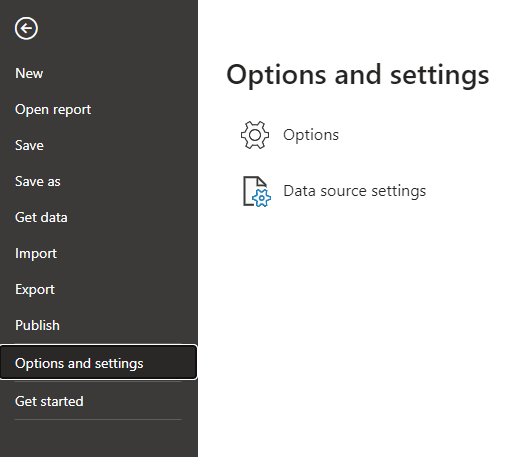
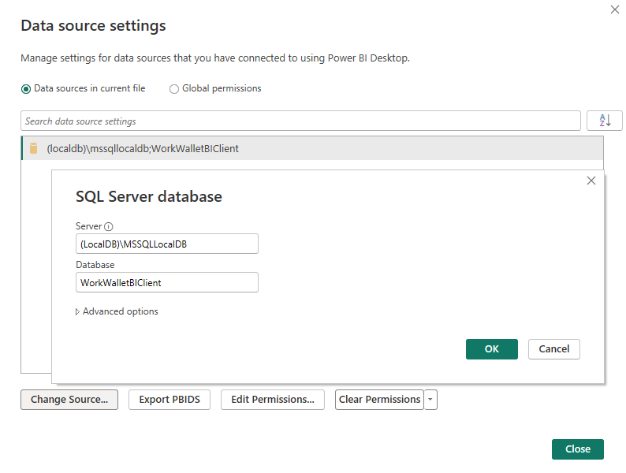
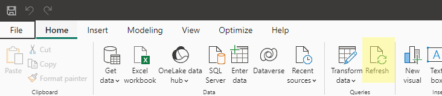
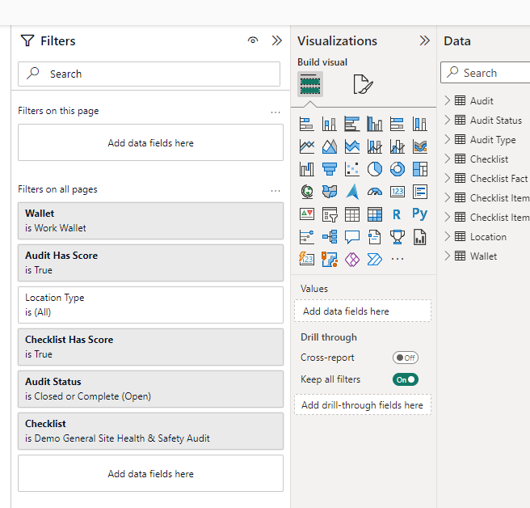

# Work Wallet Business Intelligence (BI) Client

## Changelog

### 4th May 2024

C# libraries upgraded to .NET 8.0 with improved logging.

Azure Function App migrated from in-process to isolated model.

* If migrating an existing function app, follow the instructions [here](https://learn.microsoft.com/en-us/azure/azure-functions/migrate-dotnet-to-isolated-model?tabs=net8#update-your-function-app-in-azure).

### 16th January 2024

Added in the **Assets** module.

This includes asset assignments and asset custom fields (properties). Actions associated with assets were already available.

Currently asset inspection histories and defect reports are not included.

### 25th October 2023

The client sample and client function now support processing the data for multiple wallets.

If upgrading from a version of `WorkWallet.BI.ClientSample` older than `3.0.0.0` then review the changes to the `appsettings.config` configuration file.

If using a version of the Azure function `WorkWallet.BI.ClientFunction` older than `3.0.0.0` then review the changes to the Azure function configuration.

## Overview

The [Work Wallet](https://www.work-wallet.com/) Health and Safety solution provides an API to allow organisations to automate the download of their Wallet data. The API is optimised for organisations requiring a regular feed of data for Business Intelligence (BI) purposes.

The datasets currently enabled for download are:

* Site Audits
* Reported Issues
* Inductions
* Permits
* Actions
* Assets

The API uses a combination of paging and change tracking to efficiently transfer data from the Work Wallet cloud to your local environment.

This repository provides a quick start solution to enable an organisation to get up and running with the API without needing to write a line of code. The solution may be used as is, or may be modified to suit your specific requirements. *(Or you may use the solution as a reference and develop an API consumer using your preferred technology stack.)*

## Prerequisites

These instructions assume that the reader is an experienced IT professional familiar with the Microsoft technology stack. (The .NET Core applications may be run on a Windows, Linux, or suitable cloud platform.)

* A SQL Server database server (any recent edition, including Azure SQL, Express, Developer, Standard, etc.)
* A connection string for the database (suitable for use with the package `Microsoft.Data.SqlClient`)
* Internet connectivity (with firewall access permitted to the Work Wallet API and authorisation endpoints)
* An environment suitable for running a .NET 8.0 application (or alternatively a Microsoft Azure subscription for running the code as an Azure Function App)
* If wishing to use the sample Power BI Desktop files - a local install of Microsoft Power BI Desktop
* If wishing to build the code, an installation of Microsoft Visual Studio (2022) is recommended.

## Work Wallet BI Client Architecture

The sample solution comprises:

* Scripts to create a SQL Server database that receives the data from the API. The database has a [star schema](https://en.wikipedia.org/wiki/Star_schema) optimised as a data mart.
* A console application that calls the API and stores the returned data in the database. The application can be scheduled (using your preferred scheduler) to run on a periodic basis (e.g. daily) in order to fully automate the feed. *(The code is also available as an [Azure Function](https://azure.microsoft.com/en-gb/products/functions/).)*
* [Sample Power BI Desktop Files](#sample-power-bi-desktop-files-pbix) that import the data from the database and provide rich analytical capabilities. The reports are viewed using the free [Power BI Desktop](https://powerbi.microsoft.com/en-us/desktop/) application from Microsoft. These reports can be customised, data can be combined with other (non-Work Wallet) datasets etc.. Organisations with Power BI Pro licences can publish auto-updating reports to their intranet, and benefit from a full suite of collaborative features.

Power BI is not a prerequisite to use this solution - any BI tool may be used to read and process the data held within the data mart (database).

## Technology Stack

The sample solution provided here is based on the following technology:

* Database - Microsoft SQL Server *(Azure SQL, local instance, Express, etc.)*. Hardware resource requirements are minimal.
* Application Code - .NET 8.0 / C#
* BI Platform - Microsoft Power BI

The API itself is a standard RESTful API that runs over a secure HTTPS/TLS channel.

## Contained within this Repository

In the `SampleCode` folder is a [Visual Studio](https://visualstudio.microsoft.com/) solution file `WorkWallet.BI.Client.sln` - this may be used to open and build all the components.

Pre-built binaries are available for download. See [Binaries](#binaries) below.

The following projects are provided:

| Project | |
| --- | --- |
| `WorkWallet.BI.ClientDatabaseDeploy` | A console application that creates (and upgrades) the database. Creates the database schema plus the required types and stored procedures. |
| `WorkWallet.BI.ClientSample` | A console application that calls the API and populates the database with data. |
| `WorkWallet.BI.ClientFunction` | Same as for `WorkWallet.BI.ClientSample`, but packged as an Azure Function |

## Calling the API

API access is activated and secured on a per-Wallet basis.

Contact Work Wallet to request API access for your Wallet.

Once activated, you will be provided with the following settings:

* `ApiAccessClientId`
* `ApiAccessClientSecret`
* `WalletId`
* `WalletSecret`

These settings are required to call the API.

The API endpoint is at <https://bi.work-wallet.com> and the [OAuth 2.0](https://oauth.net/2/) authorisation server is at <https://identity.work-wallet.com>.

## Binaries

All binaries target [.NET 8.0](https://dotnet.microsoft.com/en-us/download/dotnet/8.0)

| Tool | Download URL | Executable | Config. File |
| --- | --- | --- | --- |
| Database deployment | [WorkWallet.BI.ClientDatabaseDeploy_3.1.0.0.zip](https://base.azureedge.net/bi-client/WorkWallet.BI.ClientDatabaseDeploy_3.1.0.0.zip) | `WorkWallet.BI.ClientDatabaseDeploy.exe` | `appsettings.json` |
| Client sample | [WorkWallet.BI.ClientSample_3.1.0.0.zip](https://base.azureedge.net/bi-client/WorkWallet.BI.ClientSample_3.1.0.0.zip) | `WorkWallet.BI.ClientSample.exe` | `appsettings.json` |

## Creating or Upgrading the Database

`WorkWallet.BI.ClientDatabaseDeploy` project / executable

**If you have an existing installation that predates August 2023 then please read the document [Legacy Schema](./Docs/LegacySchema.md) before proceeding.**

Edit `appsettings.json` and enter the required settings:

| Setting | | Description |
| --- | --- | --- |
| AppSettings | DatabaseConnectionString | database connection string |

You will need to set a suitable SQL Server database connection string for your database server.

Run `WorkWallet.BI.ClientDatabaseDeploy.exe` from a command prompt.

This will create the database if it does not exist.
If you have an previous version, this will update the database.

(Warning: *all* stored procedures are dropped from the mart schema as a first step in the upgrade.)

## Calling the API to Download Data to the Database

`WorkWallet.BI.ClientSample` project / executable

Edit `appsettings.json` and enter the required settings:

| Setting | | | Description |
| --- | --- | --- | --- |
| ClientOptions | | ApiAccessClientId | |
| ClientOptions | | ApiAccessClientSecret | |
| ClientOptions | AgentWallets[] | WalletId | |
| ClientOptions | AgentWallets[] | WalletSecret | |
| ConnectionStrings | ClientDb | database connection string |

*The application supports the processing multiple wallets by setting multiple entries in the `AgentWallets[]` array.*

Run `WorkWallet.BI.ClientSample.exe` from a command prompt.

You can use your preferred task scheduler to automate the running of the executable.

You can obtain information about successful downloads in the `mart.ETL_ChangeDetection` table.
Change detection is used (so that only changes since last run are downloaded).
The first run can trigger a substantial download. It is recommended that you monitor the console output to check for errors, especially on the first run.

## Configuring the Azure Function App

`WorkWallet.BI.ClientFunction` project

Ignore this section if not deploying as an Azure Function.

When creating the Azure function:

* Runtime stack: .NET 8 Isolated
* Operating System: Windows
* Enable public access: On
* Enable Application Insights: Yes

You can use Visual Studio to publish the function to Azure.

The following configuration settings are required:

| Setting | Example | Description |
| --- | --- | --- |
| BITimerTriggerSchedule | `0 30 21 * * *` | [NCRONTAB](https://learn.microsoft.com/en-us/azure/azure-functions/functions-bindings-timer?tabs=python-v2%2Cin-process%2Cnodejs-v4&pivots=programming-language-csharp#ncrontab-expressions) expression |
| FuncOptions:AgentApiUrl | `https://bi.work-wallet.com` | |
| FuncOptions:AgentPageSize | `500` | |
| FuncOptions:AgentWallets:[0]:WalletId | | |
| FuncOptions:AgentWallets:[0]:WalletSecret | | |
| FuncOptions:ApiAccessAuthority | `https://identity.work-wallet.com` | |
| FuncOptions:ApiAccessClientId | | |
| FuncOptions:ApiAccessClientSecret | | |
| FuncOptions:ApiAccessScope | `ww_bi_extract` | |
| sqldb_connection | | database connection string |

When developing locally within Visual Studio you will need a `local.settings.json` file to supply the settings.

Example `local.settings.json`:

```json
{
  "IsEncrypted": false,
  "Values": {
    "FUNCTIONS_WORKER_RUNTIME": "dotnet-isolated",
    "APPLICATIONINSIGHTS_CONNECTION_STRING": "[required]",
    "AzureWebJobsStorage": "UseDevelopmentStorage=true",
    "BITimerTriggerSchedule": "0 30 21 * * *",
    "FuncOptions:ApiAccessAuthority": "https://identity.work-wallet.com",
    "FuncOptions:ApiAccessClientId": "[required]",
    "FuncOptions:ApiAccessClientSecret": "[required]",
    "FuncOptions:ApiAccessScope": "ww_bi_extract",
    "FuncOptions:AgentApiUrl": "https://bi.work-wallet.com",
    "FuncOptions:AgentWallets:[0]:WalletId": "[required]",
    "FuncOptions:AgentWallets:[0]:WalletSecret": "[required]",
    "FuncOptions:AgentPageSize": "500",
    "sqldb_connection": "Server=(localdb)\\MSSQLLocalDB;Database=WorkWalletBIClient;Integrated Security=true"
  }
}
```

## Sample Power BI Desktop Files (.pbix)

Work Wallet provides sample Power BI Desktop (`.pbix`) files.
These files may be downloaded and used with your own Wallet data, and modified as required.
The files may alternatively be used simply to help inform your own BI model and reporting designs.

Power BI Desktop is available as a free [download](https://powerbi.microsoft.com/en-us/desktop/) from Microsoft.

If you have a [Power BI Pro licence](https://powerbi.microsoft.com/en-gb/power-bi-pro/) then you can benefit from auto-updating reports plus full distribution and collaboration features.

(Note that any BI or reporting solution may be used - it is not necessary to use Power BI with the Work Wallet BI interface. If using an alternative, you may use the Power BI model as a reference design.)

The following sample pbix files are available for download:

| Data Area | Download URL |
| --- | --- |
| Site Audits | [SiteAudits_reference_2.0.1.0.pbix](https://workwalletcdnorigin.blob.core.windows.net/bi-client/pbix/SiteAudits_reference_2.0.1.0.pbix) |
| Reported Issues | [ReportedIssues_reference_2.0.1.0.pbix](https://workwalletcdnorigin.blob.core.windows.net/bi-client/pbix/ReportedIssues_reference_2.0.1.0.pbix) |
| Inductions | [Inductions_reference_2.0.1.0.pbix](https://workwalletcdnorigin.blob.core.windows.net/bi-client/pbix/Inductions_reference_2.0.1.0.pbix) |
| Permits | [Permits_reference_2.0.1.0.pbix](https://workwalletcdnorigin.blob.core.windows.net/bi-client/pbix/Permits_reference_2.0.1.0.pbix) |
| Actions | [Actions_reference_2.0.1.0.pbix](https://workwalletcdnorigin.blob.core.windows.net/bi-client/pbix/Actions_reference_2.0.1.0.pbix) |
| Assets | [Assets_reference_2.0.1.0.pbix](https://workwalletcdnorigin.blob.core.windows.net/bi-client/pbix/Assets_reference_2.0.1.0.pbix) |

The sample files contain data from a demo Wallet.
To use these files with your own data you need to connect to your local database and refresh the data.

### Connecting to the Database

Select `File` and then `Options and settings`:



Select `Data source settings` and `Change Source...`:



### Refresh the Data

The data within the .pbix file is only refreshed on demand. *(Use Power BI Pro for automatic refreshing of data, distribtution, and collaboration features.)*

To refresh the data, press the `Refresh` button on the `Home` tab.



### Adjust Report Filters

After refreshing the Power BI model with your data, it is necessary to check and adjust the filters on the reports (otherwise no data may be shown).

For instance, in the example below it is necessary to change the filters for the `Wallet` and `Checklist`.


